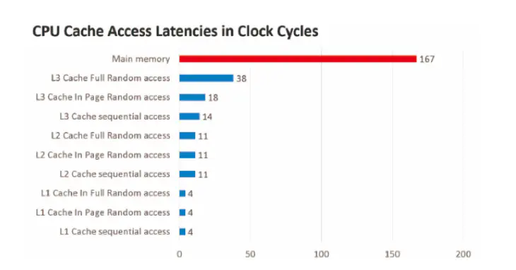
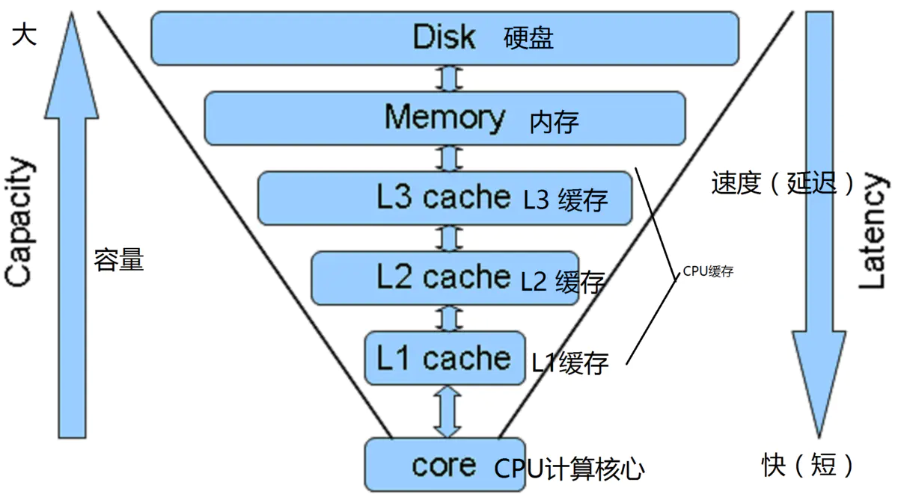

# volatile 关键字

## CPU 缓存模型

**CPU 缓存访问速度对比**

> 因为速度差距过大的原因，如果还是采用CPU直接读取内存上面的数据，就会导致CPU资源严重的浪费！于是那些生产CPU的科技公司就设计出了，在CPU和内存之间增加一层缓存的方案，现在的CPU基本都是三级缓存了，L1 ，L2 ，L3 缓存

> 在有了CPU缓存之后，我们就可以在程序运行的过程中，先从内存拷贝一份数据到CPU缓存中，然后CPU计算都操作缓存里的数据，等执行完成的时候，再把缓存中的数据更新到内存里，从而增加CPU的使用效率。

## CPU 缓存模型下的并发问题

在引入CPU缓存之后，主了提高CPU的使用效率之外，还带来了一个数据不一致的问题。比如i++这一个操作，在引入了CPU缓存之后，它具体的情况是这样的：

> 1. 将内存中的i复制一份到CPU缓存当中
> 2. CPU核心读取CPU缓存中的i
> 3. 对i执行+1操作
> 4. 将更新后的i写回CPU缓存
> 5. 将CPU缓存中的i更新到内存中

对于单线程来说，这完成不会有什么问题，但是对于多线程来说，就会出现错误了，因为每个线程都有自己的工作空间。比如，现在有线程A和线程B同时对i执行i++操作，我们假设i一开始为0，我们期望最后的结果是2，但是最后的结果可能1：比如:

> 1. 线程A将内存中的i复制一份到CPU缓存当中，此时 i = 0;
> 2. 线程B将内存中的i复制一份到CPU缓存当中，此时 i = 0;
> 3. 线程A对应的CPU核心1读取CPU缓存中的i,并执行+1操作，然后把更新后的i写回CPU缓存(i=1)
> 4. 线程B对应的CPU核心2读取CPU缓存中的i,并执行+1操作，然后把更新后的i写回CPU缓存(i=1)
> 5. 线程A将CPU缓存中的i更新到内存(i=1)
> 6. 线程B将CPU缓存中的i更新到内存(i=1)

出现这种情况的原因也是很简单的，比如多个CPU核心都从内存拷贝了一份数据到各自的缓存当中，然后直接拿缓存中的数据来执行+1操作，最后再把数据刷新内存，于是就造成了这个问题。由于Demo过于简单，我就不给出来了。下面我们回顾一下历史，看看这个问题是怎么被解决的，其实解决这个问题的方案有两种:

> 第一种是早期的方案，因为CPU和计算机的其他组件通信是通过总线来进行的，
> 比如数据通信就是通过数据总线来进行，如果一个CPU核心要操作某个数据了，
> 就通过向总线发送一个LOCK＃的信号来获取总线锁，那么其他CPU核心就被阻塞了，
> 从而只有一个CPU核心能对内存进行访问。

但是这种方案明显效率是比较低的，于是就提出了第二方案：

> 通过缓存一致性协议来解决数据不一致的问题，即CPU在操作CPU缓存中的数据时，
> 如果发现它是一个共享变量(其他CPU也缓存了一个副本)，那么他会进行以下的两种操作：
> (1) 读操作，只会将数据单纯读到寄存器，不做额外处理
> (2) 写操作，发出一个信号告诉其他CPU核心，你缓存的数据已经无效啦，让其他CPU在读取共享变量时，不得不重新去内存中重新拿过数据。

## MESI 缓存一致性协议

> **`MESI`**（`Modified Exclusive Shared Or Invalid`）(也称为伊利诺斯协议，是因为该协议由伊利诺斯州立大学提出）是一种广泛使用的支持写回策略的缓存一致性协议。

### MESI协议中的状态

`CPU`中每个缓存行（`caceh line`)使用4种状态进行标记（使用额外的两位(`bit`)表示):

**M: 被修改（Modified)**

该缓存行只被缓存在该`CPU`的缓存中，并且是被修改过的（`dirty`),即与主存中的数据不一致，该缓存行中的内存需要在未来的某个时间点（允许其它`CPU`读取请主存中相应内存之前）写回（`write back`）主存。

当被写回主存之后，该缓存行的状态会变成独享（`exclusive`)状态。

**E: 独享的（Exclusive)**

该缓存行只被缓存在该`CPU`的缓存中，它是未被修改过的（`clean`)，与主存中数据一致。该状态可以在任何时刻当有其它`CPU`读取该内存时变成共享状态（`shared`)。

同样地，当`CPU`修改该缓存行中内容时，该状态可以变成`Modified`状态。

**S: 共享的（Shared)**

该状态意味着该缓存行可能被多个`CPU`缓存，并且各个缓存中的数据与主存数据一致（`clean`)，当有一个`CPU`修改该缓存行中，其它`CPU`中该缓存行可以被作废（变成无效状态（`Invalid`））。

**I: 无效的（Invalid）**

该缓存是无效的（可能有其它`CPU`修改了该缓存行）。

### MESI状态转换图

## Java 内存模型

> Java内存模型（Java Memory Model，简称JMM）是一种抽象的概念，并不是真实存在的，它描述的是一组规范或者规定。JVM运行程序的实体是线程，每一个线程都有自己私有的工作内存。Java内存模型中规定了所有变量都存储在主内存中，主内存是一块共享内存区域，所有线程都可以访问。但是线程对变量的读取赋值等操作必须在自己的工作内存中进行，在操作之前先把变量从主内存中复制到自己的工作内存中，然后对变量进行操作，操作完成后再把变量写回主内存。线程不能直接操作主内存中的变量，线程的工作内存中存放的是主内存中变量的副本。

关于主内存与工作内存之间的具体交互协议，即一个变量如何从主内存拷贝到工作内存、如何从工作内存同步到主内存之间的实现细节，Java内存模型定义了以下八种操作来完成：

- **lock（锁定）**：作用于主内存的变量，把一个变量标识为一条线程独占状态。
- **unlock（解锁）**：作用于主内存变量，把一个处于锁定状态的变量释放出来，释放后的变量才可以被其他线程锁定。
- **read（读取）**：作用于主内存变量，把一个变量值从主内存传输到线程的工作内存中，以便随后的load动作使用
- **load（载入）**：作用于工作内存的变量，它把read操作从主内存中得到的变量值放入工作内存的变量副本中。
- **use（使用）**：作用于工作内存的变量，把工作内存中的一个变量值传递给执行引擎，每当虚拟机遇到一个需要使用变量的值的字节码指令时将会执行这个操作。
- **assign（赋值）**：作用于工作内存的变量，它把一个从执行引擎接收到的值赋值给工作内存的变量，每当虚拟机遇到一个给变量赋值的字节码指令时执行这个操作。
- **store（存储）**：作用于工作内存的变量，把工作内存中的一个变量的值传送到主内存中，以便随后的write的操作。
- **write（写入）**：作用于主内存的变量，它把store操作从工作内存中一个变量的值传送到主内存的变量中。

## 并发编程的三大特性：可见性、原子性、有序性

### **原子性** 

> 即一个操作或者多个操作，要么全部执行并且执行的过程不会被任何因素打断，要么就都不执行。

### 如何保证原子性

在Java内存模型中，只保证了基本读取和赋值的原子性操作。如果想保证多个操作的原子性，需要使用`synchronized`关键字或者`Lock`相关的工具类。如果想要使int、long等类型的自增操作具有原子性，可以用java.util.concurrent.atomic包下的工具类，如：`AtomicInteger`、`AtomicLong`等。另外需要注意的是，`volatile`关键字不具有保证原子性的语义。

### 可见性

> 可见性是指当多个线程访问同一个变量时，一个线程修改了这个变量的值，其他线程能够立即看得到修改的值。

### 如何保证可见性？

在Java中可以用以下3种方式保证可见性。

1. **使用`volatile`关键字**

当一个变量被`volatile`关键字修饰时，其他线程对该变量进行了修改后，会导致当前线程在工作内存中的变量副本失效，必须从主内存中再次获取，当前线程修改工作内存中的变量后，同时也会立刻将其修改刷新到主内存中。

2. **使用`synchronized`关键字**

`synchronized`关键字能够保证同一时刻只有一个线程获得锁，然后执行同步方法或者代码块，并且确保在锁释放之前，会把变量的修改刷新到主内存中。

3. **使用`Lock`相关的工具类**

`Lock`相关的工具类的`lock`方法能够保证同一时刻只有一个线程获得锁，然后执行同步代码块，并且确保执行`Lock`相关的工具类的`unlock`方法在之前，会把变量的修改刷新到主内存中。

### 有序性

> 即程序执行的顺序按照代码的先后顺序执行。

### 如何保证有序性

这里就要提到Java内存模型的一个叫做先行发生（Happens-Before）的原则了。如果两个操作的执行顺序无法从Happens-Before原则推到出来，那么可以对它们进行随意的重排序处理了。Happens-Before原则有哪些呢？

- 程序次序原则：一段代码在单线程中执行的结果是有序的。
- 锁定原则：一个锁处于被锁定状态，那么必须先执行`unlock`操作后面才能进行`lock`操作。
- volatile变量原则：同时对`volatile`变量进行读写操作，写操作一定先于读操作。
- 线程启动原则：`Thread`对象的`start`方法先于此线程的每一个动作。
- 线程终结原则：线程中的所有操作都先于对此线程的终止检测。
- 线程中断原则：对线程`interrupt`方法的调用先于被中断线程的代码检测到中断事件的发生。
- 对象终结原则：一个对象的初始化完成先于它的`finalize`方法的开始。
- 传递原则：操作A先于操作B，操作B先于操作C，那么操作A一定先于操作C。

除了Happens-Before原则提供的天然有序性，我们还可以用以下几种方式保证有序性：

- 使用`volatile`关键字保证有序性。
- 使用`synchronized`关键字保证有序性。
- 使用`Lock`相关的工具类保证有序性。

## happens-before

- **只要不改变程序的执行结果，编译器和处理器想怎么优化就怎么优化**
- **happens-before这么做的目的，都是为了在不改变程序执行结果的前提下，尽可能地提高程序执行的并行度。**

### 规则

1. **程序次序规则：**一个线程内，按照代码顺序，书写在前面的操作先行发生于书写在后面的操作
2. **锁定规则：**一个unLock操作先行发生于后面对同一个锁额lock操作

3. **volatile变量规则：**对一个变量的写操作先行发生于后面对这个变量的读操作，volatile变量写，再是读，必须保证是先写，再读

4. **传递规则：**如果操作A先行发生于操作B，而操作B又先行发生于操作C，则可以得出操作A先行发生于操作C

5. **线程启动规则：**Thread对象的start()方法先行发生于此线程的每个一个动作

6. **线程中断规则：**对线程interrupt()方法的调用先行发生于被中断线程的代码检测到中断事件的发生

7. **线程终结规则：**线程中所有的操作都先行发生于线程的终止检测，我们可以通过Thread.join()方法结束、Thread.isAlive()的返回值手段检测到线程已经终止执行

8. **对象终结规则：**一个对象的初始化完成先行发生于他的finalize()方法的开始

## 内存屏障

**Store 屏障**

-  `static volatile int i = 1` 会加 Store 屏障
- 加了 Store 屏障之后，就会强制性要求CPU在进行写操作之前必须阻塞等待其他CPU返回 invalidate ack 之后，对数据加锁，然后修改数据到缓存中，并且在写入缓存之后强制执行 flush 操作将数据刷回主存
- 要求一个写操作必须刷到主内存，不能停留在CPU缓存里

**Load 屏障**

-  `static volatile int i = this.num` 会加 Load 屏障
- 加了 Load 屏障之后，从高速缓存中读取数据的时候，如果发现无效队列里有一个 invalidate 消息，此时会立即强制根据 invalidate 消息把当前 CPU 缓存数据设置为过期，然后就可以强制从主存中加载最新的数据

> 参考资料：
>
> 1. 缓存模型&CPU 缓存模型下的并发问题：https://www.jianshu.com/p/542132229172
> 2. MESI 缓存一致性协议：https://www.cnblogs.com/z00377750/p/9180644.html
> 3. Java 内存模型：https://zhuanlan.zhihu.com/p/29881777  
> 4. 并发编程的三大特性：可见性、原子性、有序性：https://zhuanlan.zhihu.com/p/141744632