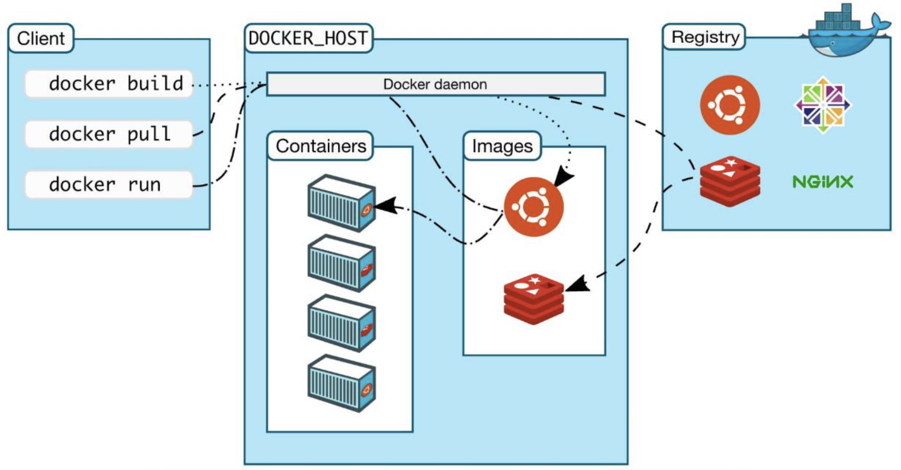
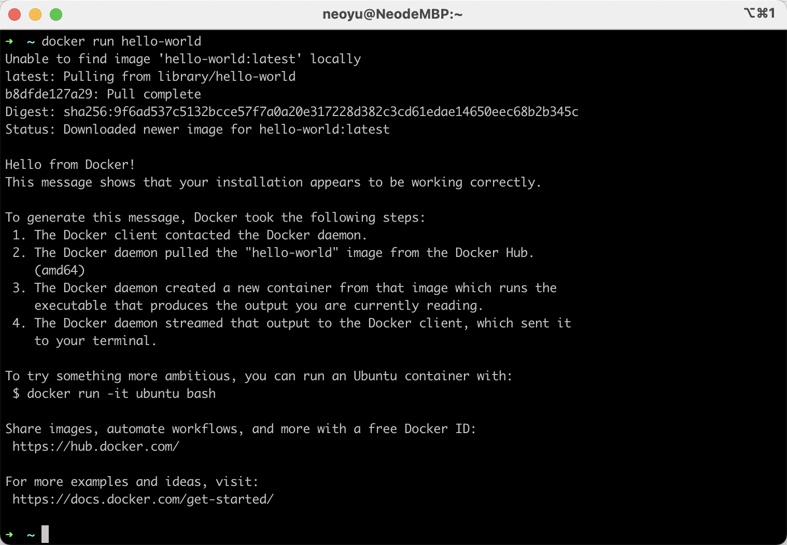
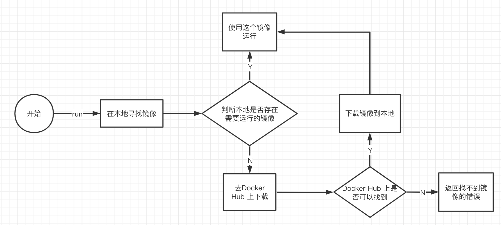
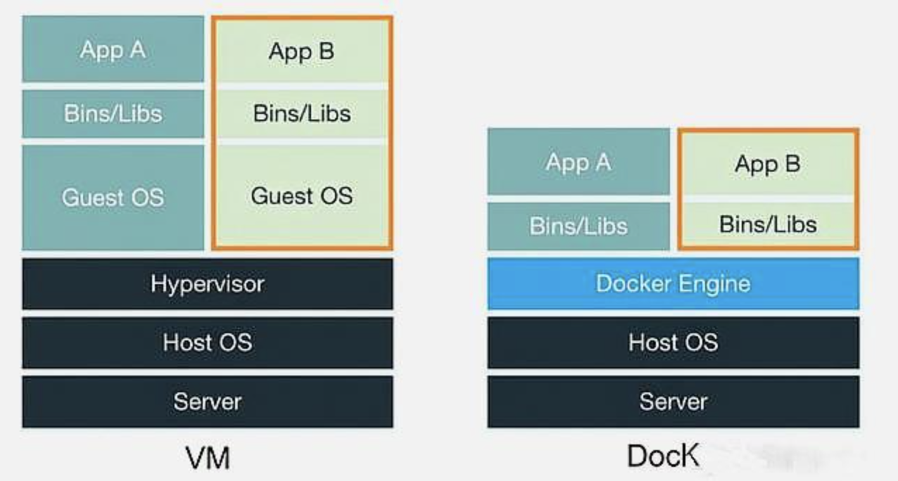

# Docker 安装

## Docker 的基本组成

- 镜像（Images）

  > Docker 镜像就好比是一个模板，可以通过这个模板来创建容器服务，Redis ==> run ===> Redis-01 容器（提供服务器），通过这个镜像可以创建多个容器（最终服务或项目运行就在容器中）

- 容器（Containers）

  > Docker 利用容器技术，独立运行一个或一组通过镜像创建的应用
  >
  > 启动、停止、删除 的基本命令
  >
  > 可以把容器理解为一个微型的 Linux 系统

- 仓库（Repository）

  > 存放镜像的地方，仓库分为公有和私有
  >
  > Docker Hub 默认是国外的
  >
  > 阿里、华为等都有国内的镜像服务

## 使用 `docker run` 的流程

## 底层原理

### Docker 是怎么工作的？

Docker 是一个 Client - Server 结构的系统，Docker 的守护进程运行在主机上，通过 Socket 在客户端访问。Docker Server 接收到 Docker Client 的指令，就会执行这个命令

### Docker 为什么比虚拟机快？

1. Docker 有着比虚拟机更少的抽象层
2. Docker 使用的宿主机的内核，VM 需要的是 Guest OS

> 新建一个容器的时候，Docker 不需要像虚拟机一样重新加载一个操作系统的内核，避免引导。虚拟机是加载 Guest OS，分钟级别的。Docker 是利用宿主机的操作系统，启动时秒级的

