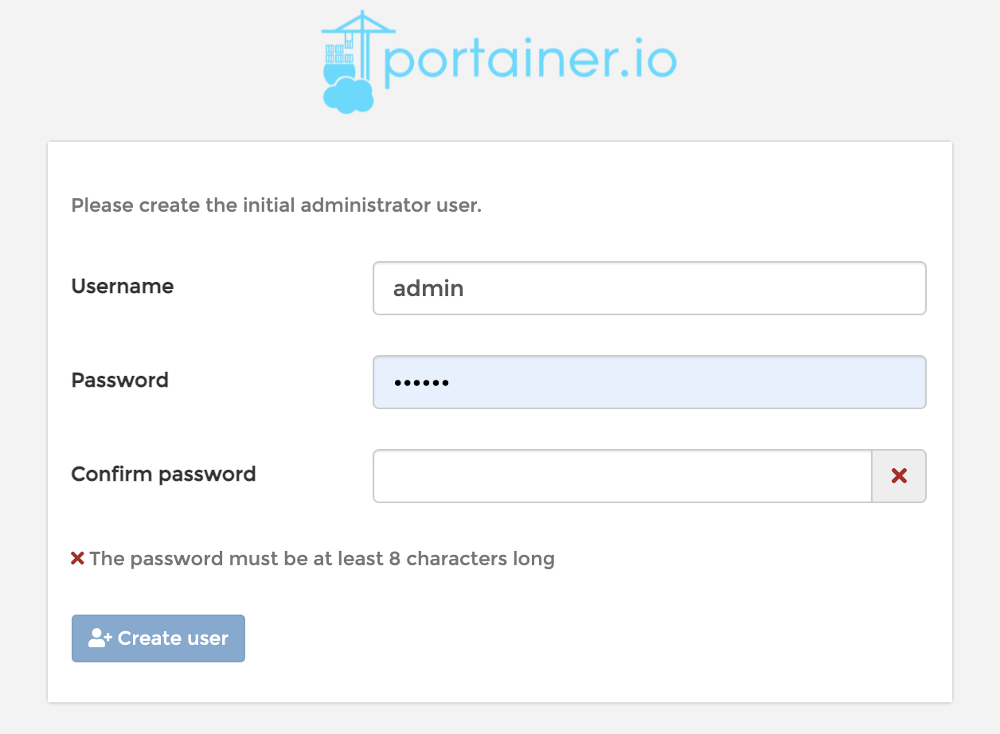
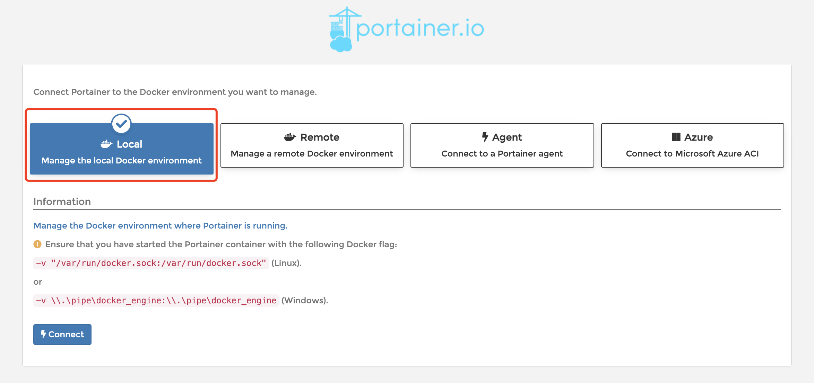
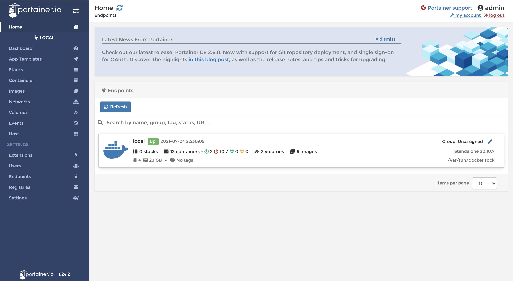

# Docker 可视化

- portainer（先用这个）

  ```shell
  docker run -d -p 8088:9000 \
  --restart=always \
  -v /var/run/docker.sock:/var/run/docker.sock \
  --privileged=true \
  portainer/portainer
  ```

- Rancher（CI/CD）

## 什么是 portainer ？

> Portainer是一个可视化的容器镜像的图形管理工具，利用Portainer可以轻松构建，管理和维护Docker环境。 而且完全免费，基于容器化的安装方式，方便高效部署。

## 安装并启动 portainer

```shell
➜  ~ docker run -d -p 8088:9000 \
--restart=always \
-v /var/run/docker.sock:/var/run/docker.sock \
--privileged=true \
portainer/portainer
Unable to find image 'portainer/portainer:latest' locally
latest: Pulling from portainer/portainer
94cfa856b2b1: Pull complete
49d59ee0881a: Pull complete
a2300fd28637: Pull complete
Digest: sha256:fb45b43738646048a0a0cc74fcee2865b69efde857e710126084ee5de9be0f3f
Status: Downloaded newer image for portainer/portainer:latest
35f3b864721d51cf24d5382a88389ca680430ef6737bab5a7596e263691da675
# 测试 portainer 是否启动成功
➜  ~ curl localhost:8088
<!DOCTYPE html>
<html lang="en" ng-app="portainer">
# 此处省略一万字
</html>
```

> 测试访问：http://localhost:8088

## 初始化 portainer

1. 设置用户名&密码

   

2. 选择连接本地的环境

   

3. 进入之后的面板

   