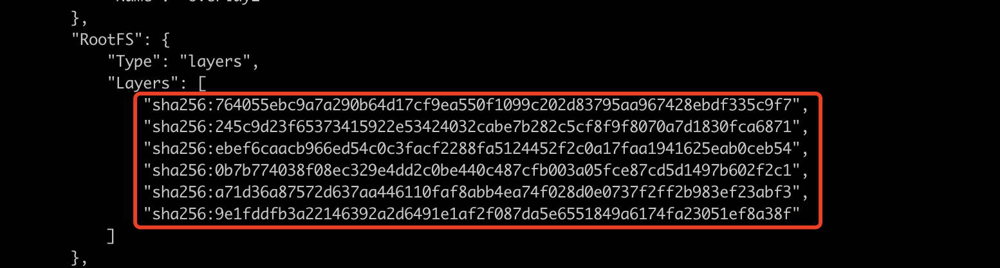
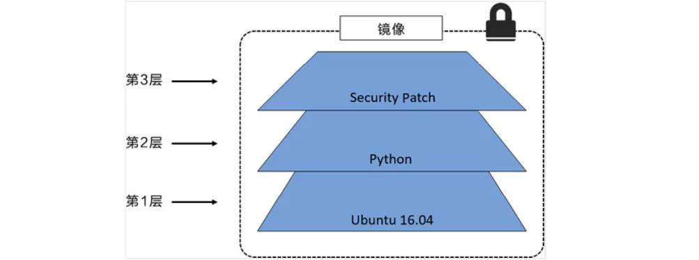
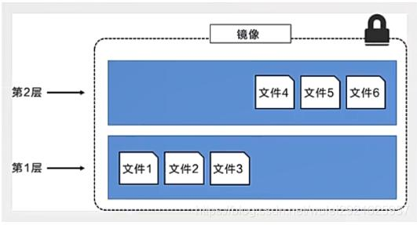
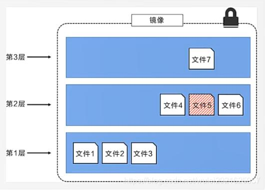
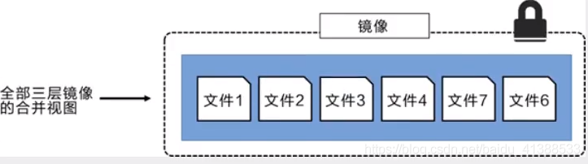
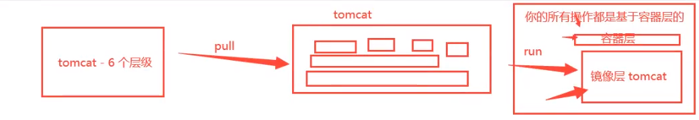

# Docker镜像讲解

## 镜像是什么？

> **镜像是什么？**
>
> 镜像是一种轻量、可执行的软件包，用来打包软件运行环境和基于运行环境开发的软件，它包含运行某个软件所需的所有内容，包括代码、运行时环境、依赖库、环境变量和配置文件
>
> 所有应用直接打包 Docker 镜像，就可以直接部署
>
> 如何得到镜像：
>
> - 从远程仓库下载
> - 第三方拷贝
> - 自己制作一个镜像 DockerFile


## Union FS （联合文件系统）

Union文件系统（UnionFS）是一种分层、轻量级并且高性能的文件系统，它支持对文件系统的修改作为一次提交来一层层的叠加，同时可以将不同目录挂载到同一个虚拟文件系统下(unite several directories into a single virtual filesystem)。Union 文件系统是 Docker 镜像的基础。镜像可以通过分层来进行继承，基于基础镜像（没有父镜像），可以制作各种具体的应用镜像。


### Docker 镜像加载原理

Docker的镜像实际上由一层一层的文件系统组成，这种层级的文件系统UnionFS。
bootfs(boot file system)主要包含bootloader和kernel, bootloader主要是引导加载kernel, Linux刚启动时会加载bootfs文件系统，在Docker镜像的最底层是bootfs。这一层与我们典型的Linux/Unix系统是一样的，包含boot加载器和内核。当boot加载完成之后整个内核就都在内存中了，此时内存的使用权已由bootfs转交给内核，此时系统也会卸载bootfs。

rootfs (root file system) ，在bootfs之上。包含的就是典型 Linux 系统中的 /dev, /proc, /bin, /etc 等标准目录和文件。rootfs就是各种不同的操作系统发行版，比如Ubuntu，Centos等等。


**平时我们安装进虚拟机的CentOS都是好几个G，为什么docker这里才200M？**

对于一个精简的OS，rootfs可以很小，只需要包括最基本的命令、工具和程序库就可以了，因为底层直接用Host的kernel，自己只需要提供 rootfs 就行了。由此可见对于不同的linux发行版, bootfs基本是一致的, rootfs会有差别, 因此不同的发行版可以公用bootfs。

**查看分层信息**

```shell
➜  ~ docker pull redis
➜  ~ docker image inspect redis:latest # 查看镜像的分层信息
```




## 理解

所有 Docker 的镜像都起始于一个最基础的镜像，当进行修改或增加新的内容时，就会在当前镜像层之上，创建新的镜像层。

举一个简单的例子：假如基于 Ubuntu Linux 16.04 创建一个新的镜像，这就是新镜像的第一层；如果在该镜像中添加 Python 包，就会在基础镜像层之上创建第二层镜像；如果继续添加一个安全补丁，就会创建第三个镜像层。

该镜像已经包含3个镜像层，如下图所示（这只是一个用于演示的简单例子）



在额外添加镜像层的同时，镜像始终保持是当前所有镜像的组合，理解这一点非常重要。下图中列举一个简单的例子，每个镜像包含3个文件，而且镜像包含了来自2个镜像层的6个文件



上图中的镜像层跟之前图中的略有区别，主要目的是便于展示文件。

下图中做了一个稍微复杂的3层镜像，在外部看来整个镜像只有6个文件，这是因为最上层的文件7是文件5的一个更新版本。



- 这种情况下，上层镜像中的文件覆盖了底层镜像中的文件。这样就使得文件的更新版本作为一个新的镜像层添加到镜像当中。

- Docker 通过存储引擎（新版本采用快照机制）的方式来实现镜像层堆栈，并保证多镜像层对外展示位统一的文件系统。

- Linux 上可用的存储引擎有 AUFS、OverLay2、Device Mapper、Btrfs、以及 ZFS。顾名思义，每种存储引擎都基于Linux中对应的文件系统或者块设备技术，并且每种存储引擎都有其独有的性能特点。

- Docker 在 Windows 上仅支持 windows filter 一种存储引擎，该引擎基于 NTFS 文件系统之上实现了分层和 CoW
  下图展示了与系统显示相同的三层镜像。所有镜像层堆叠并合并，对外提供统一的视图。

  

**特点**

- Docker 镜像都是**只读**的，当**容器启动**时，**一个新的可写层被加载到镜像的顶部**
- 这一层就是我们通常说的容器层，容器之下的都叫镜像层

