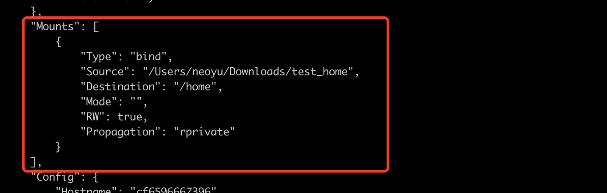
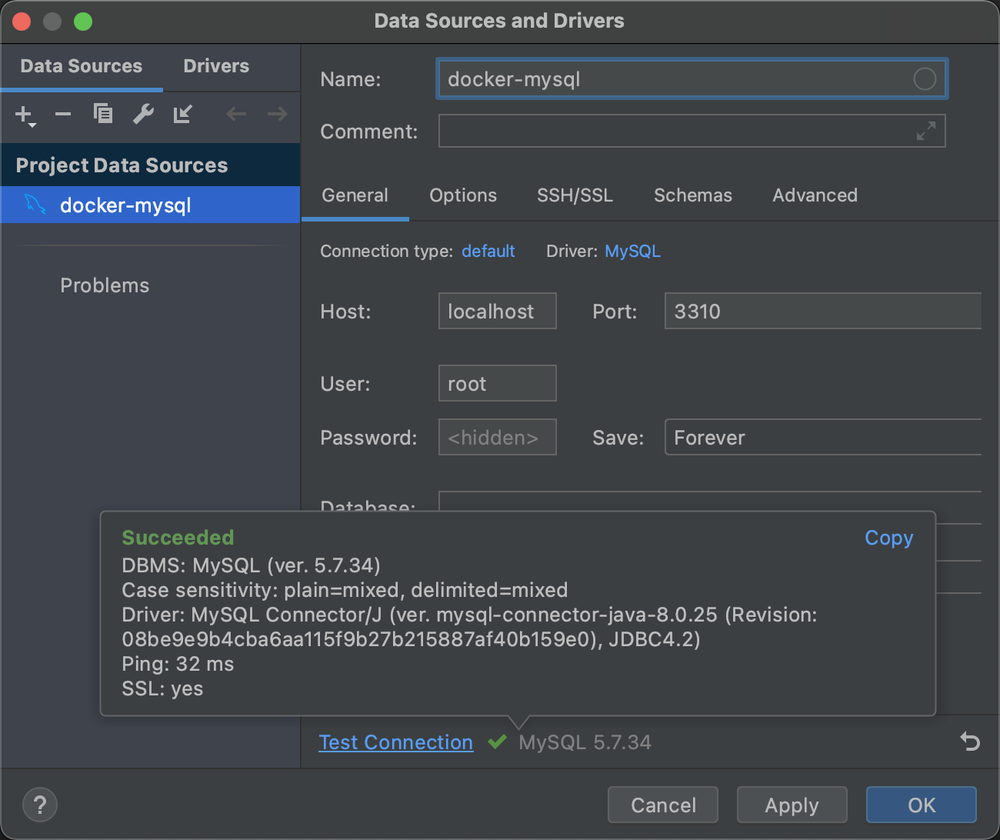
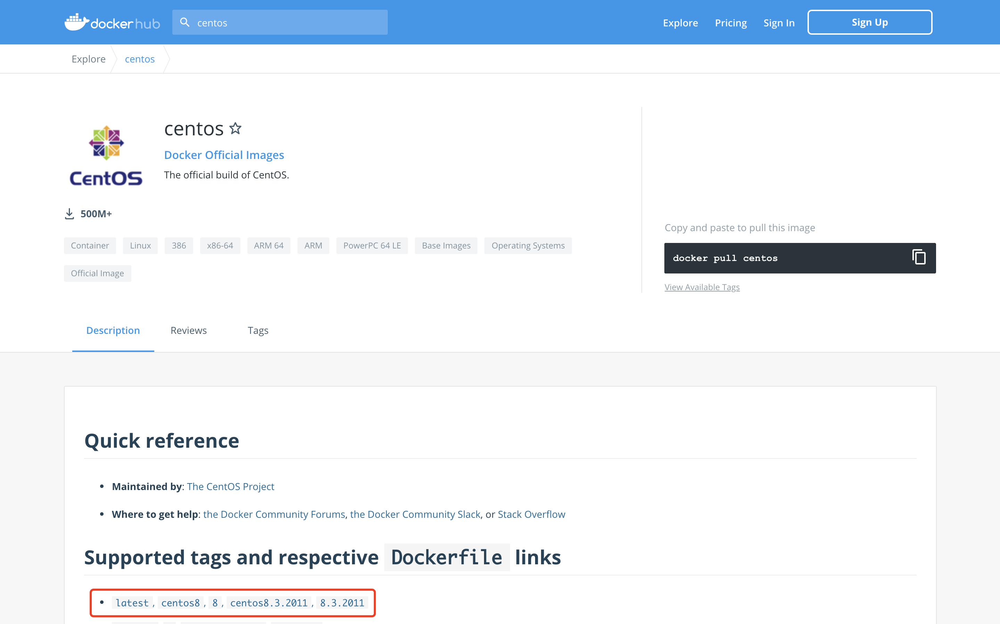
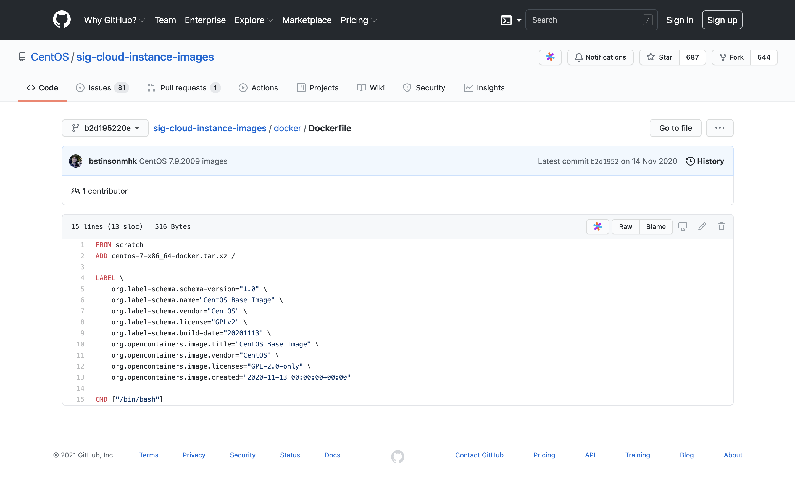
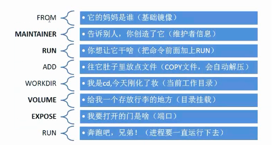

Docker 容器数据卷

## 什么是容器数据卷？

Docker 的理念：将应用和环境打包成一个镜像

如果数据都在容器中，那么如果我们吧容器删除了，数据就会丢失！

**需求：数据持久化**

MySQL 容器删了，删库跑路！

**需求：MySQL 数据可以存储在本地**

容器之间可以有一个数据共享技术！Docker 容器中产生的数据可以同步到本地

这就是卷技术！目录的关在，将我们容器内的目录，挂载到 Linux 上面

**总结：容器的持久化和同步操作，容器间也是可以数据共享的**


## 使用数据卷

### 方式一：直接使用命令来挂载

> docker run -it -v 主机目录:容器目录
>
> ➜  ~ docker run -it -v /Users/neoyu/Downloads/test_home:/home/test_home centos /bin/bash

```shell
# 1.主机启动容器
➜  ~ docker run -it -v /Users/neoyu/Downloads/test_home:/home centos /bin/bash
[root@cf6596667396 /]# cd home/
[root@cf6596667396 home]# ls
# 2.容器内创建一个测试文件
[root@cf6596667396 home]# touch DockerTest.txt

# 3.主机内查看同步文件
➜  ~ ls ~/Downloads/test_home
DockerTest.txt

➜  ~ docker ps
CONTAINER ID   IMAGE     COMMAND       CREATED         STATUS         PORTS     NAMES
cf6596667396   centos    "/bin/bash"   4 minutes ago   Up 4 minutes             naughty_banzai
# 4.查看数据卷的挂载信息，如下图：
➜  ~ docker inspect cf6596667396
```



> 此数据卷方式正反向操作均可，可以由容器内同步到主机，也可以由主机同步到容器内


#### 实战：安装MySQL

> 官方启动 MySQL 命令
>
> `$ docker run --name some-mysql -e MYSQL_ROOT_PASSWORD=my-secret-pw -d mysql:tag`

```shell
# 下载容器镜像
➜  ~ docker pull mysql:5.7
5.7: Pulling from library/mysql
b4d181a07f80: Already exists
a462b60610f5: Pull complete
578fafb77ab8: Pull complete
524046006037: Pull complete
d0cbe54c8855: Pull complete
aa18e05cc46d: Pull complete
32ca814c833f: Pull complete
52645b4af634: Pull complete
bca6a5b14385: Pull complete
309f36297c75: Pull complete
7d75cacde0f8: Pull complete
Digest: sha256:1a2f9cd257e75cc80e9118b303d1648366bc2049101449bf2c8d82b022ea86b7
Status: Downloaded newer image for mysql:5.7
docker.io/library/mysql:5.7
# Docker Hub 官方启动 MySQL 命令
# docker run --name some-mysql -e MYSQL_ROOT_PASSWORD=my-secret-pw -d mysql:tag
# 启动 MySQL容器
# -d			后台运行
# -p			端口映射
# -v			卷挂载
# -e 			环境配置
# --name	容器名称
➜  ~ docker run -d -p 3310:3306 -v /Users/neoyu/Downloads/mysql/conf:/etc/mysql/conf.d -v /Users/neoyu/Downloads/mysql/data:/var/lib/mysql -e MYSQL_ROOT_PASSWORD=123456 --name mysql_01 mysql:5.7
2b0128d84c3a976cccfe2c7a2ae4aba589845c35486a5a1d3ab0e3841d10aba4
```

使用 DataGrip 测试连接



```shell
➜  ~ docker ps -a									# 查看容器
CONTAINER ID   IMAGE                 COMMAND                  CREATED        STATUS                      PORTS     NAMES
2b0128d84c3a   mysql:5.7             "docker-entrypoint.s…"   17 hours ago   Exited (0) 11 hours ago               mysql_01
➜  ~ docker rm 2b0128d84c3a				# 删除 mysql_01 容器
2b0128d84c3a
➜  ~ ls ~/Downloads/mysql					# 此时查看挂载在主机的数据，并没有随容器一起删除
conf data
```


#### 具名挂载和匿名挂载

```shell
# 匿名挂载
# -v 容器内路径

# 匿名挂载的方式启动 Nginx
➜  ~ docker run -d -P --name nginx_01 -v /etc/nginx nginx		
79ce98818d7a25b89b8ab7e17612787704fdd365090daf9c9ae997a2d21bc1b1

➜  ~ docker volume ls					# 查看所有的卷的情况，发现所有的卷都是匿名挂载
DRIVER    VOLUME NAME
local     1edd538de943e1b8bc2ab3f96b0598fb97ff20233a8c774ea284b221ebc302f7
local     78f004d244854f604f26175817c8f48fac08ec6e7265c556c311b0256f1fc4bc
local     c65185452ac44107849742966223c0c47089c999e233479d3454bec8de233c50

# 具名挂载的方式启动 Nginx，通过 -v [卷名]:[容器内路径]
➜  ~ docker run -d -P --name nginx_02 -v nginx_juming:/etc/nginx nginx
b32399694ee50886b8e587ba68d9e4c2648012ed5b6da8a553e14db372dde89c
➜  ~ docker volume ls			# 查看所有的卷的情况
DRIVER    VOLUME NAME
local     nginx_juming
# 查看容器卷挂载信息
➜  ~ docker volume inspect nginx_juming
[
    {
        "CreatedAt": "2021-07-06T04:11:48Z",
        "Driver": "local",
        "Labels": null,
        "Mountpoint": "/var/lib/docker/volumes/nginx_juming/_data",
        "Name": "nginx_juming",
        "Options": null,
        "Scope": "local"
    }
]
```

所有 Docker 容器内的卷，没有指定目录的情况下都是在：`/var/lib/docker/volumes/xxx/_data`

通过具名挂载的方式可以方便的找到容器数据卷的挂载路径，大多数情况下我们使用**具名挂载**

```shell
# 如何区分：具名挂载、匿名挂载、指定路径挂载

-v [容器内路径]								# 匿名挂载

-v [卷名]:[容器内路径]			  	 # 具名挂载

-v [/宿主机路径]:[容器内路径]  	 # 指定路径挂载
```

**拓展：**

```shell
# 通过 -v 容器内路径：ro rw 改变读写权限
# ro		readonly 只能通过宿主机来改变
# rw		readwrite 默认可读可写
# 只要设置了容器权限，容器多我们挂载出来的内容就有限定了
➜  ~ docker run -d -P --name nginx_02 -v nginx_juming:/etc/nginx:ro nginx
➜  ~ docker run -d -P --name nginx_02 -v nginx_juming:/etc/nginx:rw nginx
```


## 初识 Dockerfile

Dockerfile 就是用来构建 docker 镜像的文件

```shell
# 创建 docker-test-volume 目录
➜  Downloads mkdir docker-test-volume
➜  Downloads cd docker-test-volume
➜  docker-test-volume pwd
/Users/neoyu/Downloads/docker-test-volume
# 创建 dockerfile_01 文件
➜  docker-test-volume vim dockerfile_01
# ================= dockerfile_01 文件内容开始 =================
FROM centos

VOLUME ["/volume01","/volume02"]

CMD echo "===== end ====="

CMD /bin/bash
# ================= dockerfile_01 文件内容结束 =================

# 使用 docker build 构建镜像，不要忘记最后的点，最后的点代表当前目录
➜  docker-test-volume docker build -f ./dockerfile_01 -t neo/centos:1.0 .
[+] Building 0.1s (5/5) FINISHED
 => [internal] load build definition from dockerfile_01                                                                    0.0s
 => => transferring dockerfile: 134B                                                                                       0.0s
 => [internal] load .dockerignore                                                                                          0.0s
 => => transferring context: 2B                                                                                            0.0s
 => [internal] load metadata for docker.io/library/centos:latest                                                           0.0s
 => CACHED [1/1] FROM docker.io/library/centos                                                                             0.0s
 => exporting to image                                                                                                     0.0s
 => => exporting layers                                                                                                    0.0s
 => => writing image sha256:a8228cf54d86f11d9cbd06ed408bbd319fe4c41ce2de2b0864d715a2654bd6cb                               0.0s
 => => naming to docker.io/neo/centos:1.0                                                                                  0.0s

Use 'docker scan' to run Snyk tests against images to find vulnerabilities and learn how to fix them
# 查看构建好的镜像
➜  docker-test-volume docker images
REPOSITORY   TAG       IMAGE ID       CREATED        SIZE
centos       latest    300e315adb2f   7 months ago   209MB
neo/centos   1.0       a8228cf54d86   7 months ago   209MB
➜  docker-test-volume docker run -it a8228cf54d86 /bin/bash
[root@073c7c653cd5 /]# ls -l
total 56
drwxr-xr-x   2 root root 4096 Jul 10 04:30 volume01				# 挂载的目录和主机某个目录同步
drwxr-xr-x   2 root root 4096 Jul 10 04:30 volume02
# 查看容器信息
➜  docker-test-volume docker ps
CONTAINER ID   IMAGE          COMMAND       CREATED          STATUS          PORTS     NAMES
b68a8703f1a8   a8228cf54d86   "/bin/bash"   41 seconds ago   Up 41 seconds             kind_goldberg
# 查看卷挂载信息
➜  docker-test-volume docker inspect b68a8703f1a8
... # 省略部分内容
"Mounts": [
            {
                "Type": "volume",
                "Name": "e8461b9f6be4912cde03dc44b37be4d855f940972db6274300fd3c7476d18351",
                "Source": "/var/lib/docker/volumes/e8461b9f6be4912cde03dc44b37be4d855f940972db6274300fd3c7476d18351/_data",
                "Destination": "/volume01",
                "Driver": "local",
                "Mode": "",
                "RW": true,
                "Propagation": ""
            },
            {
                "Type": "volume",
                "Name": "d04c74fd9f061a6926fa65db5edbf31e3b12193783df1b13b254a0f3ba7f5168",
                "Source": "/var/lib/docker/volumes/d04c74fd9f061a6926fa65db5edbf31e3b12193783df1b13b254a0f3ba7f5168/_data",
                "Destination": "/volume02",
                "Driver": "local",
                "Mode": "",
                "RW": true,
                "Propagation": ""
            }
        ]
```


## 容器内数据卷同步

> 两个或多个容器之间实现数据共享

```shell
# 启动自己构建的 centos:1.0 镜像
# 启动容器：docker01
➜  docker-test-volume docker run -it --name docker01 neo/centos:1.0
# 启动容器：docker02，通过 --volumes-from 挂载 docker01 的数据卷
➜  docker-test-volume docker run -it --name docker02 --volumes-from docker01 neo/centos:1.0
# 启动容器：docker03，通过 --volumes-from 挂载 docker01 的数据卷
➜  docker-test-volume docker run -it --name docker03 --volumes-from docker01 neo/centos:1.0
# 此时3个容器内的 volume01、volume02 目录就是同步的状态
```

> 创建容器数据卷同步之后，删除 docker01 容器，此时 docker02、docker03 的 volume01、volume02 下的数据还是存在的
>
> 数据共享卷的方式是目录双向同步拷贝

## 多个 MySQL 实现数据共享

```shell
# 启动 mysql_01
➜  ~ docker run -d -p 3310:3306 -v /etc/mysql/conf.d -v /var/lib/mysql -e MYSQL_ROOT_PASSWORD=123456 --name mysql_01 mysql:5.7

# 启动 mysql_02 并挂载 mysql_01
➜  ~ docker run -d -p 3310:3306 -e MYSQL_ROOT_PASSWORD=123456 --name --volumes-from mysql_01 mysql_02 mysql:5.7
```

**结论**

> 容器之间配置信息的同步，数据卷容器的生命周期一直持续到没有容器使用为止，而一旦持久化挂载到宿主机，这个时候数据是不会随容器删除的

## DockerFile

### Dockerfile介绍

> dockerfile 是用来构建 docker 镜像文件的命令参数脚本

**构建步骤**

1. 编写一个 dockerfile 文件
2. `docker build` 构建成为一个镜像
3. `docker run` 运行镜像
4. `docker push` 发布镜像（DockerHub、阿里云仓库镜像）


查看一下官方的镜像是如何构建的





### DockerFile 构建过程

**基础知识：**

1. 每个保留关键字（指令）都必须是大写字母

2. 指令从上到下顺序执行

3. `#` 表示注释

4. 每一个指令都会创建并提交一个镜像层

   

### DockerFile 指令：



Environment variables are supported by the following list of instructions in the `Dockerfile`:

- `FROM`- 基础镜像
- `MANTAINER` - 维护者信息，格式：姓名+邮箱
- `RUN` - 镜像构建的时候运行的命令

- `ADD` - 需要添加的内容，如：tomcat、nginx
- `WORKDIR` - 镜像的工作目录
- `VOLUME` - 挂载的目录位置
- `EXPOSE` - 暴露端口配置，等效于 `-p` 指令
- `CMD` - 指定容器启动的时候运行的命令，只有最后一个会生效，可被替代
- `ENTRYPOINT`  - 指定容器启动的时候运行的命令，可以追加命令
- `ONBUILD` - 当构建一个被继承 DockerFIle 这个时候就会运行 `ONBUILD` 指令，出发指令
- `COPY` - 将文件拷贝到镜像中
- `ENV` - 构建的时候设置环境变量

### 实战测试

