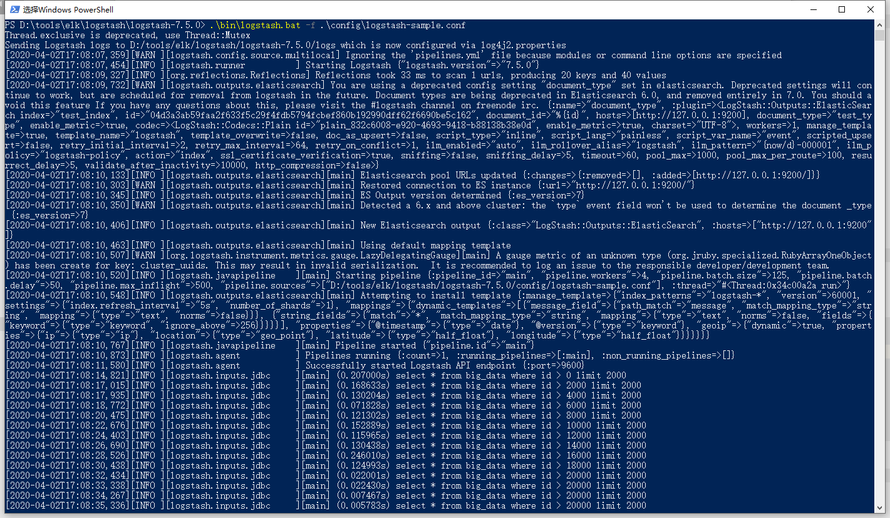

# Logstash 从mysql批量加载数据
> logstash 版本：7.5


## 配置`logstash-sample.conf`
```json
input {
    jdbc {
        jdbc_driver_library => "./logstash-7.5.0/logstash-core/lib/jars/mysql-connector-java-5.1.36.jar"
        jdbc_driver_class => "com.mysql.jdbc.Driver"
        jdbc_default_timezone =>"Asia/Shanghai"
        jdbc_connection_string => "jdbc:mysql://host:port/mydb?useUnicode=true&characterEncoding=UTF-8&allowMultiQueries=true&serverTimezone=Asia/Shanghai"
        jdbc_user => "root"
        jdbc_password => "password"
        statement => "select * from big_data where id > :sql_last_value limit 2000"
        use_column_value => true
        tracking_column => "id"
        clean_run => true
        schedule => "* * * * * *"
    }
}
output {      
    elasticsearch {
        hosts => "http://127.0.0.1:9200"
        index => "test_index"
        document_type => "test_type"
        document_id => "%{id}"
    }
}
```


## 启动命令 `.\bin\logstash.bat -f .\config\logstash-sample.conf`


## 问题解决
###  类似 jdbc_driver_class not fount 的问题
> 注意包的引用路径，需要放到：`./logstash-7.5.0/logstash-core/lib/jars` 目录下

### `sql_last_value` 使用问题
这个问题找了很久的答案，默认情况下该参数为上一次同步的时间点，这种在同步增量数据的时候还是可以使用的，但是如果想要同步全量数据那么更希望`sql_last_value`是上一次同步的最后一条记录的ID，查阅官方文档：

- `sql_last_value` ： The value used to calculate which rows to query. Before any query is run, this is set to Thursday, 1 January 1970, or 0 if `use_column_value` is true and `tracking_column` is set. It is updated accordingly after subsequent queries are run.

- 如果要根据时间点即默认的`sql_last_value`来同步增量数据却发现时间不对，则需要通过`jdbc_default_timezone =>"Asia/Shanghai"` 处理。
- 如果全量需要将`sql_last_value`初始化则使用`clean_run => true`


官方文档：[https://www.elastic.co/guide/en/logstash/7.5/plugins-inputs-jdbc.html](https://www.elastic.co/guide/en/logstash/7.5/plugins-inputs-jdbc.html)