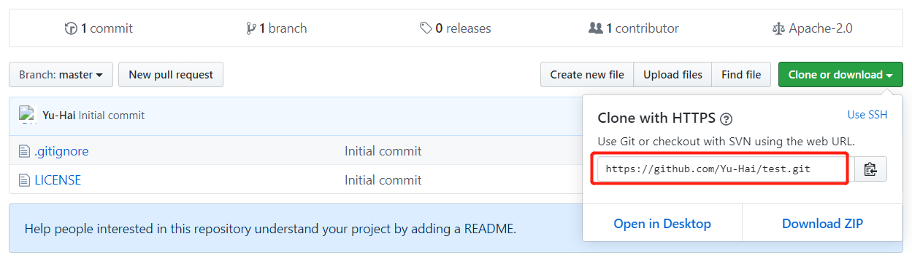
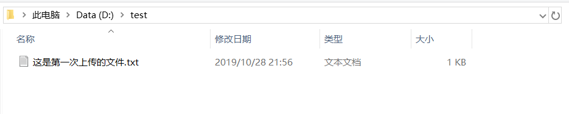
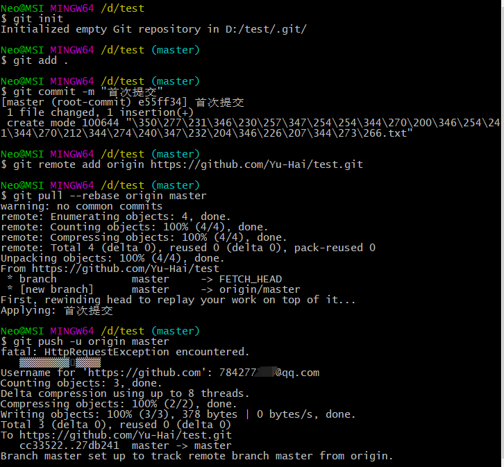
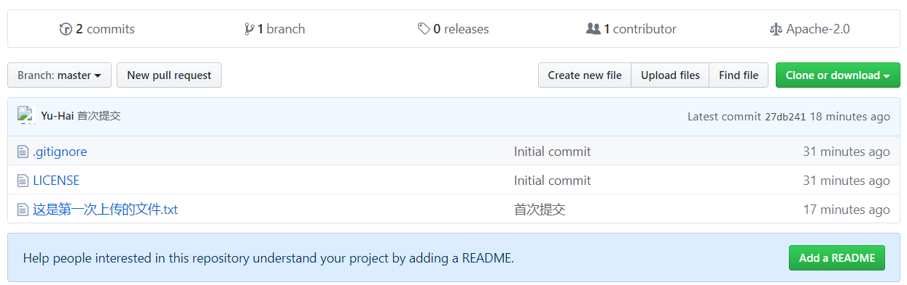

# 本地仓库代码首次提交到Github
---

#### 在 Github 上创建一个新的仓库


#### 创建一个空目录


#### 文件夹中右键 > Git Bash Here 依次输入命令
```sh
git init                                                           # 初始化版本管理
git add .                                                          # 添加所有文件到版本管理，注意最后面的 .
git commit -m "首次提交"                                            # 提交文件到本地仓库
git remote add origin https://github.com/Yu-Hai/test.git           # 添加远程仓库
git pull --rebase origin master                                    # 合并远程仓库
git push -u origin master                                          # 提交本地仓库到远程仓库
```
- 如图所示



#### 查看 Github 上的结果


> 解决频繁需要验证用户信息的问题：`git config --global credential.helper store`