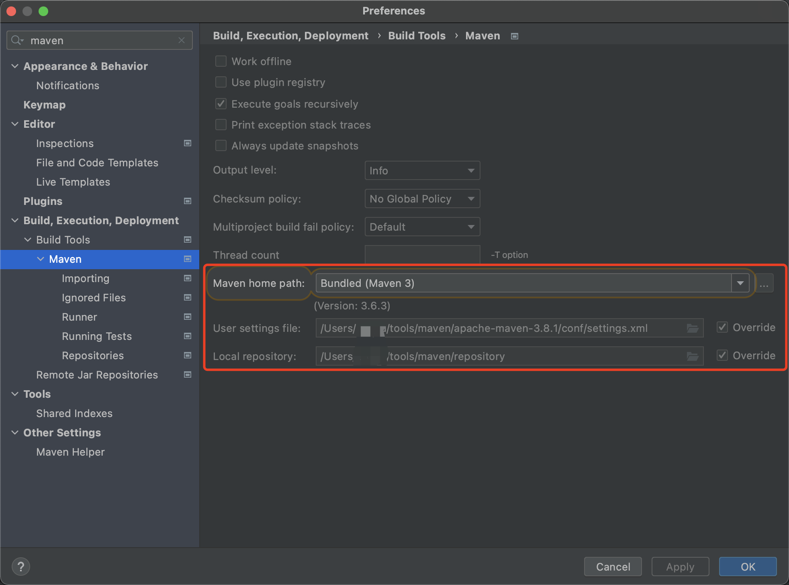
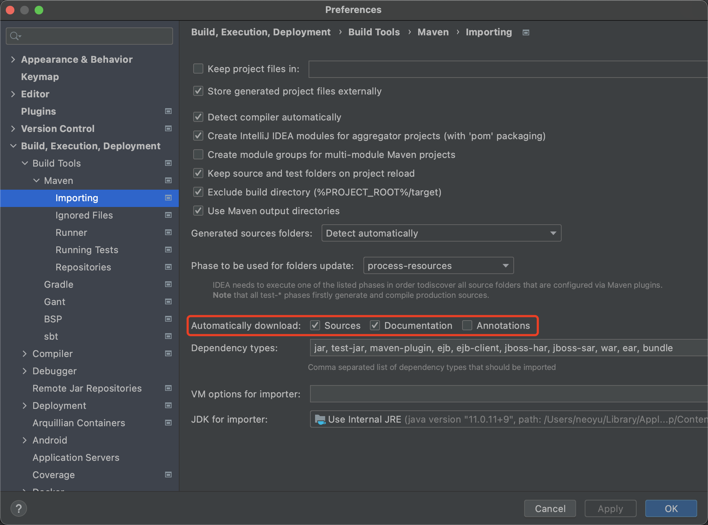
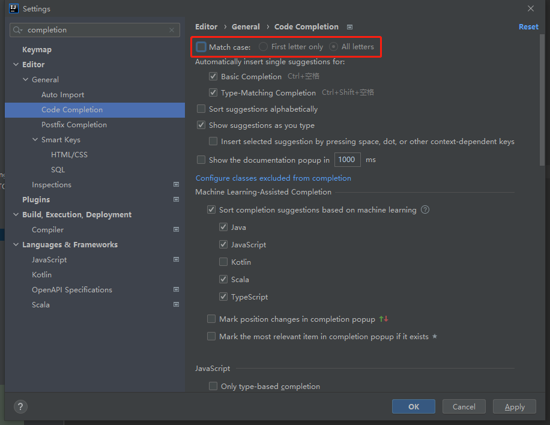
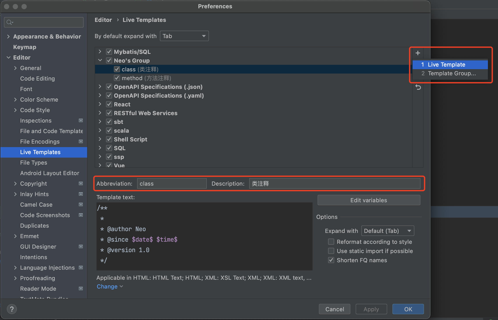
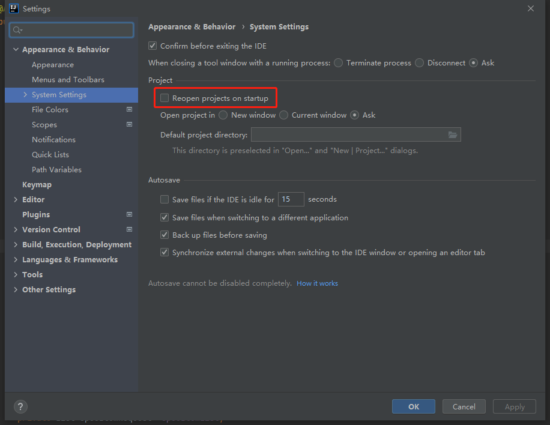
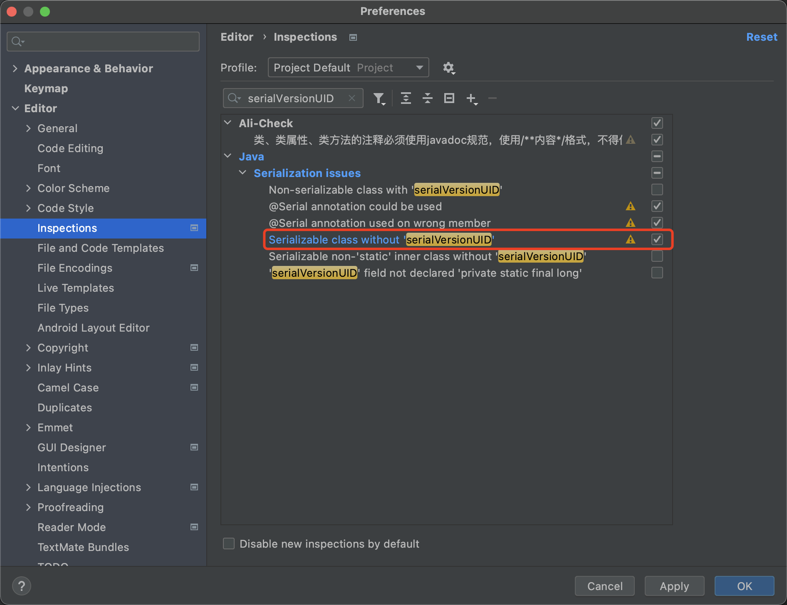

# IDEA初始化操作

## Maven



**`setting.xml` 配置阿里云镜像**

```xml
<mirror>
	<id>nexus-aliyun</id>
  <mirrorOf>central</mirrorOf>
	<name>Nexus aliyun</name>
	<url>http://maven.aliyun.com/nexus/content/groups/public</url>
</mirror>
```




## Encodings - 编码


## Indent - 缩进


## Font - 字体


## Theme - 暗黑模式


## Editor Tabs - 靠右展示编辑窗口标签


## Code Completion - 智能提示忽略大小写




## Live Template - 注释模板

- 创建 `Template Group`，自定义 Group 名称



- 在创建的 Group 里面创建 `Live Template`

  - Class

    ```
    /**
     * 
     * @author Neo
     * @since $date$ $time$
     * @version 1.0
     */
    ```

  - Method

    ```
    /**
     * 
     *
     * @author Neo
     * @since $date$ $time$
     */
    ```

## System Setting - 默认不打开项目



## Inspections - 序列化提示




## Plugins - 插件

- Translation - 翻译
- .ignore - git
- CamelCase - 命名风格转换
- Easy Code - 代码生成
- Free MyBatis plugin - MyBatis Mapper 和 XML 映射和提示
- Maven Helper - Maven 冲突解决
- Mybatis Log - 打印MyBatis日志并自动拼接参数
- RestfulTookit - Controller 请求映射，快捷键：Ctrl + Alt + N
- Lombok - Lombok 编译插件
- Codota - 代码智能提示
- String Manipulation- 字符串处理
- SequenceDiagram - 方法调用时序图

## VM Options - 参数

```
-Xms1024m
-Xmx2048m
-XX:+UseConcMarkSweepGC
-XX:SoftRefLRUPolicyMSPerMB=50
-ea
-XX:CICompilerCount=2
-Djdk.http.auth.tunneling.disabledSchemes=""
-XX:+HeapDumpOnOutOfMemoryError
-XX:-OmitStackTraceInFastThrow
-Djdk.attach.allowAttachSelf=true
-Dkotlinx.coroutines.debug=off
-Djdk.module.illegalAccess.silent=true
-Dide.no.platform.update=true
-Dsun.io.useCanonCaches=false
-XX:ReservedCodeCacheSize=512m
```

