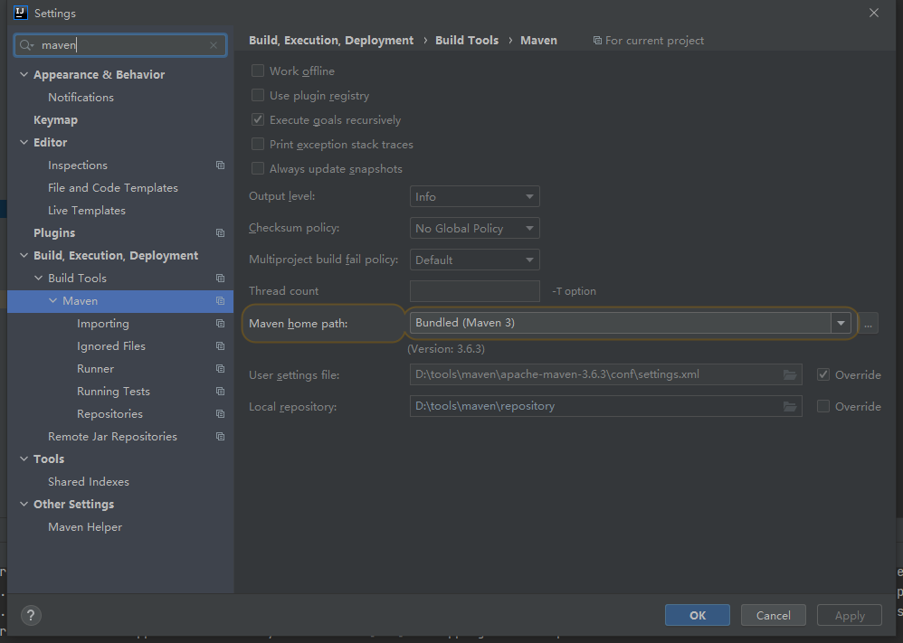
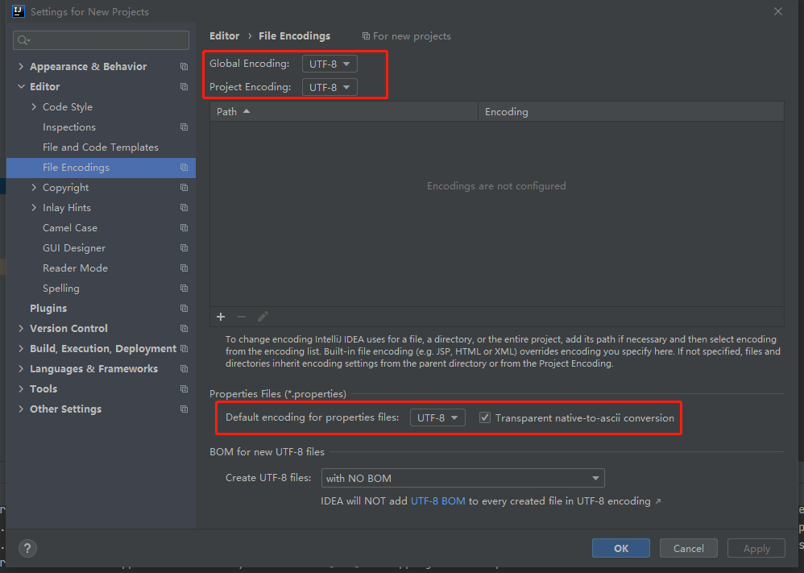
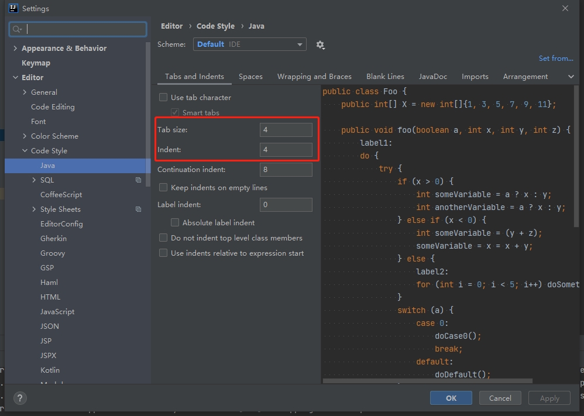
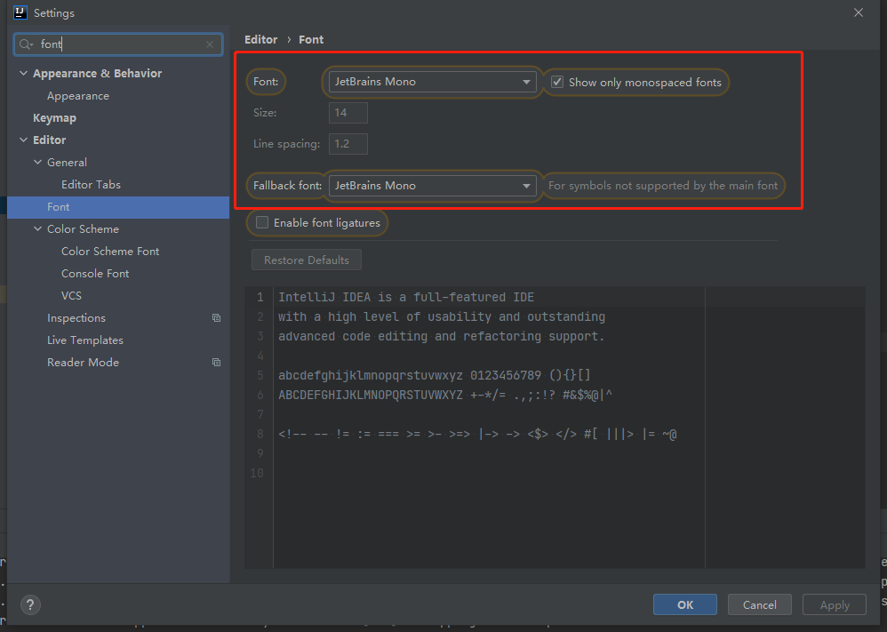
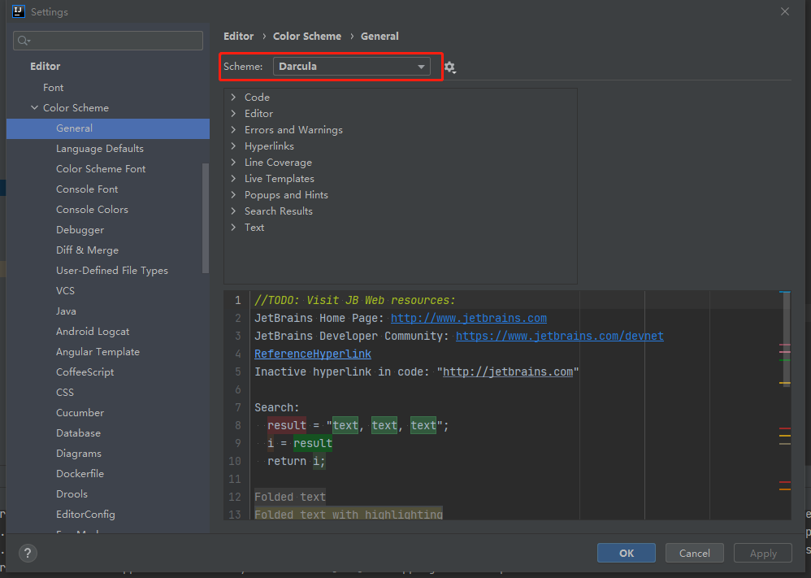
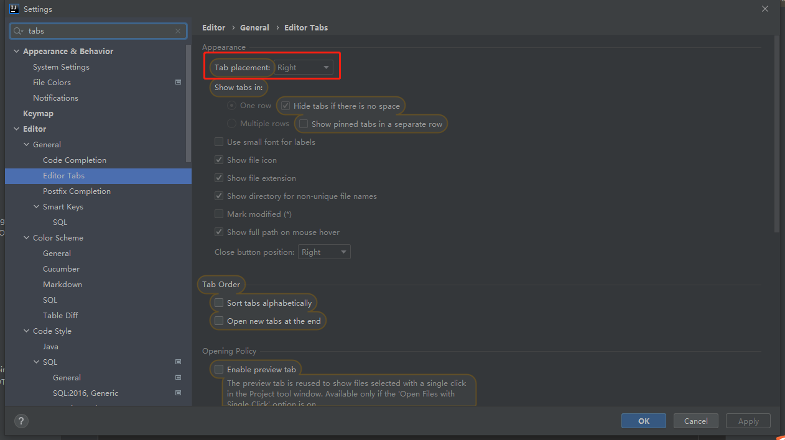

# IDEA初始化操作

## Maven



## Encodings



## Indent



## Font



## Theme



## Editor Tabs



## Plug-in

- Translation - 翻译
- .ignore - git
- CamelCase - 命名风格转换
- Easy Code - 代码生成
- Free MyBatis plugin - MyBatis Mapper 和 XML 映射和提示
- Maven Helper - Maven 冲突解决
- Mybatis Log - 打印MyBatis日志并自动拼接参数
- RestfulTookit - Controller 请求映射，快捷键：Ctrl + Alt + N
- Lombok - Lombok 编译插件
- Codota - 代码智能提示
- String Manipulation- 字符串处理
- SequenceDiagram - 方法调用时序图

## VM Options

```
-Xms1024m
-Xmx2048m
-XX:+UseConcMarkSweepGC
-XX:SoftRefLRUPolicyMSPerMB=50
-ea
-XX:CICompilerCount=2
-Djdk.http.auth.tunneling.disabledSchemes=""
-XX:+HeapDumpOnOutOfMemoryError
-XX:-OmitStackTraceInFastThrow
-Djdk.attach.allowAttachSelf=true
-Dkotlinx.coroutines.debug=off
-Djdk.module.illegalAccess.silent=true
-Dide.no.platform.update=true
-Dsun.io.useCanonCaches=false
-XX:ReservedCodeCacheSize=512m
```

