# Windows 系统 Kafka-0.10.0.1 源码阅读环境搭建

## 依赖的环境和工具

> 确保下载的工具版本与下面列举的一致

- `jdk 1.8` 自行下载并配置
- `zookeeper-3.4.9` : https://archive.apache.org/dist/zookeeper/zookeeper-3.4.9/zookeeper-3.4.9.tar.gz
- `scala-2.10.6` : https://downloads.lightbend.com/scala/2.10.6/scala.msi
- `gradle-3.1` : https://downloads.gradle-dn.com/distributions/gradle-3.1-bin.zip
- 配置 Jdk、Scala 、Gradle 环境变量并验证是否配置成功

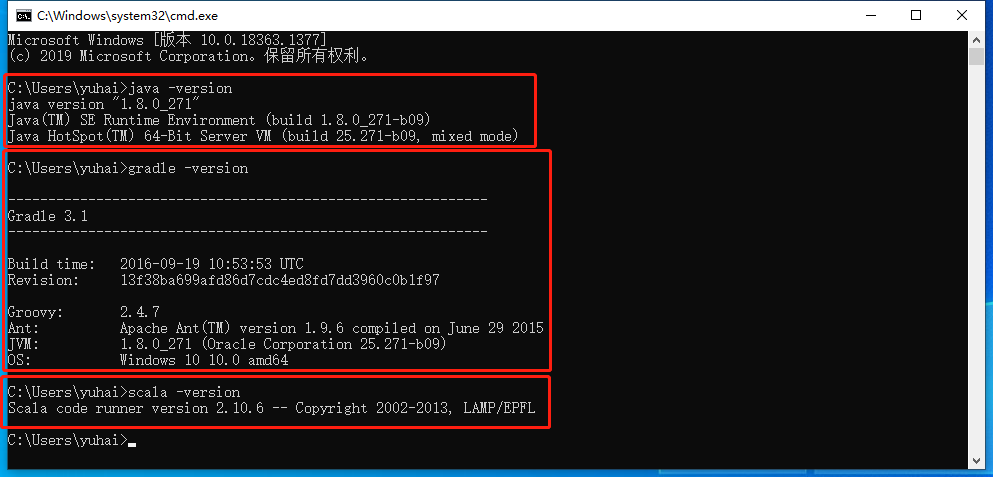

## Zookeeper 配置

- 本地将 `zookeeper-3.4.9` 解压至 `D:\tools\zookeeper\`

- 在 `D:\tools\zookeeper\`  下创建一个 `data` 目录

- 进入 `zookeeper-3.4.9\conf`目录，复制 `zoo_simple.cfg` 并重命名为：`zoo.cfg`

- 如图修改 `dataDir`

  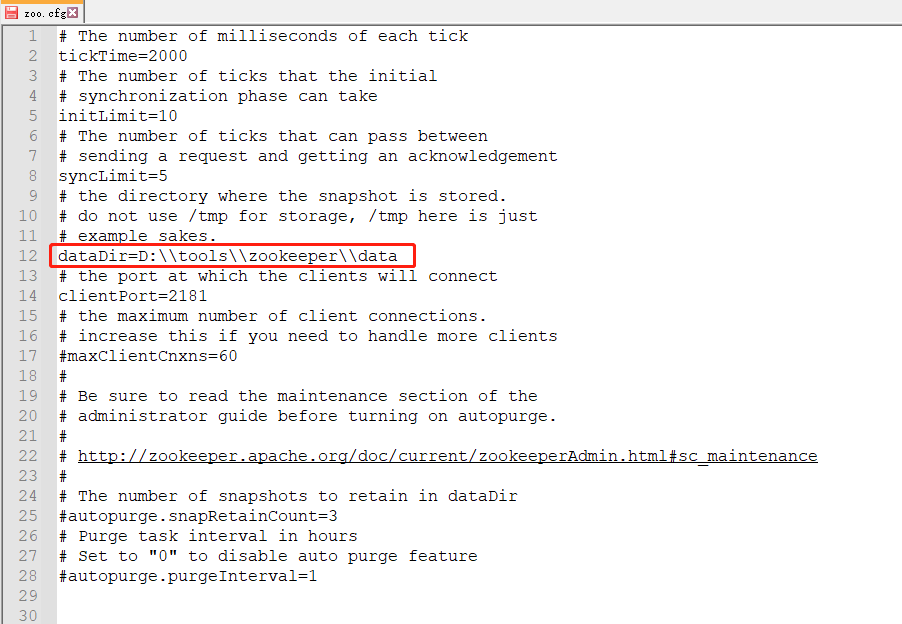

- 进入 `cmd` 运行 `zkServer.cmd`

  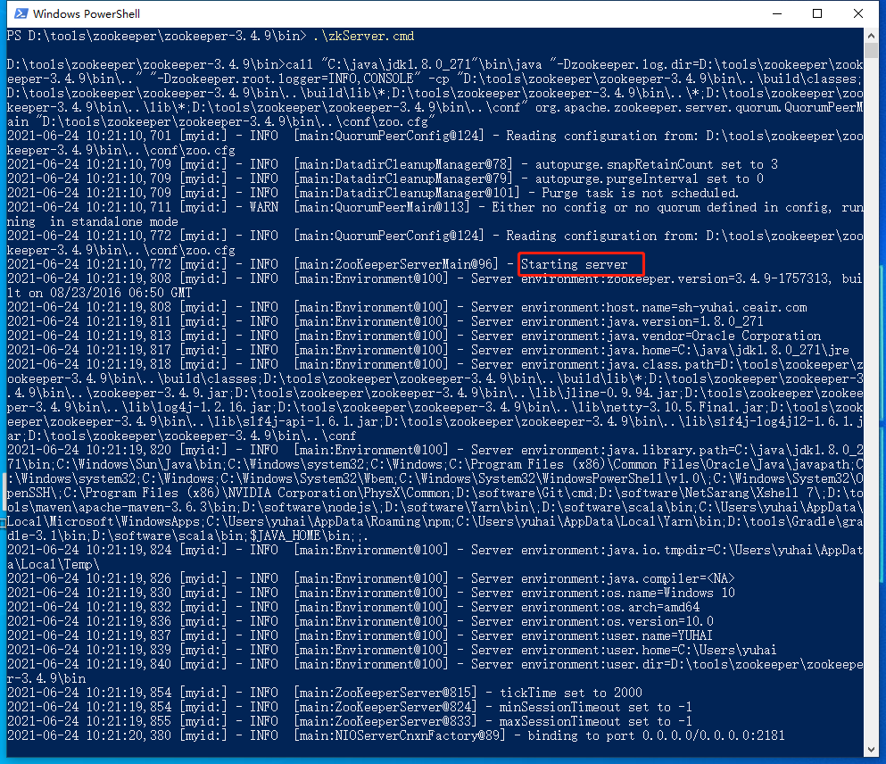


## Kafka-0.10.0.1 配置

- 修改 `kafka-0.10.0.1-src` 目录下的 `build.gradle` 文件

  ```
  ScalaCompileOptions.metaClass.daemonServer = true
  ScalaCompileOptions.metaClass.fork = true
  ScalaCompileOptions.metaClass.useAnt = false
  ScalaCompileOptions.metaClass.useCompileDaemon = false
  ```

  在下图所示位置加上上面四行代码

  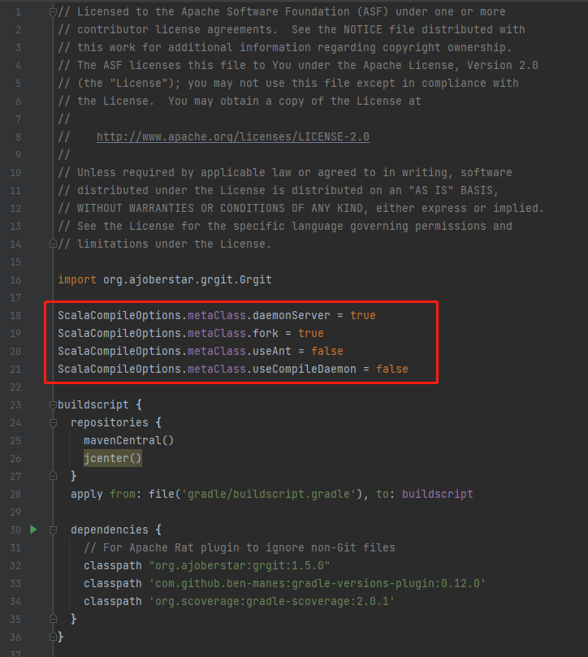

- 在 `cmd` 中 `kafka-0.10.0.1-src` 目录下运行：`gradle idea` 命令，然后进入漫长的等待...

  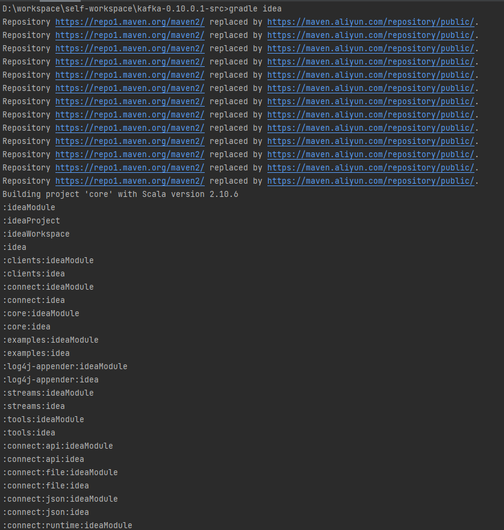

- 构建成功

  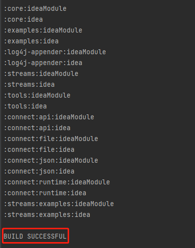

- 导入到 IDEA，并设置为 Gradle 项目

- 配置 IDEA gradle 版本

  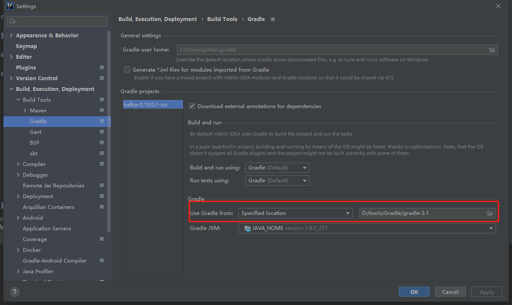

- 重新加载项目

  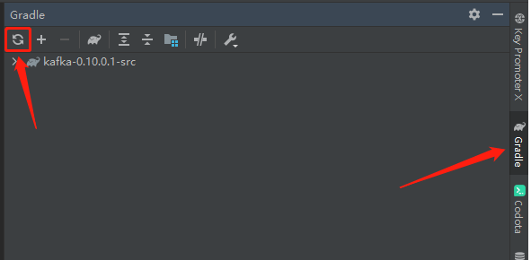

- 将 `config/log4j.properties` 复制到 `core/src/main/resources` 目录下，`resources`需自行创建

  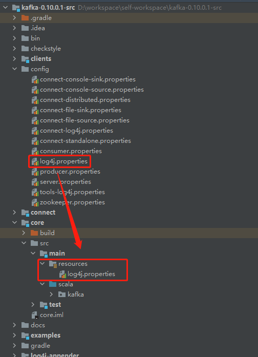

- 修改 `config/server.properties`文件中的 `log.dirs`

  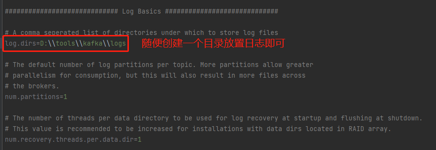

- 配置启动类

  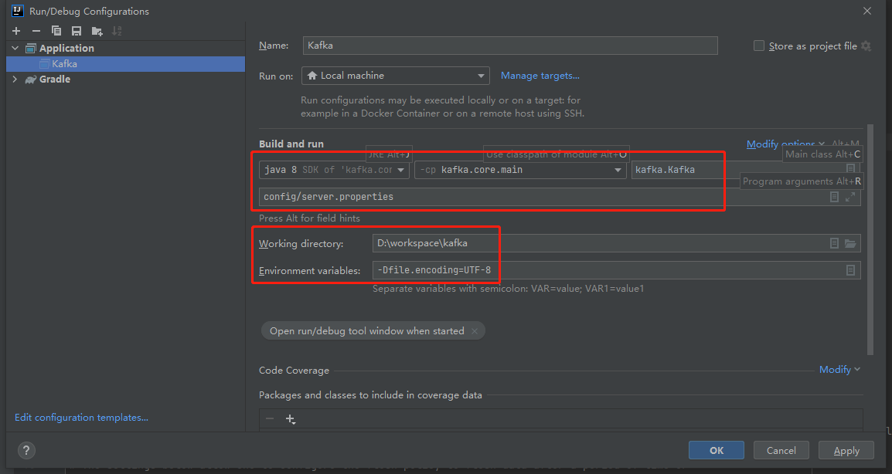

- 查看启动日志

```
Repository https://repo1.maven.org/maven2/ replaced by https://maven.aliyun.com/repository/public/.
Repository https://repo1.maven.org/maven2/ replaced by https://maven.aliyun.com/repository/public/.
Repository https://repo1.maven.org/maven2/ replaced by https://maven.aliyun.com/repository/public/.
Repository https://repo1.maven.org/maven2/ replaced by https://maven.aliyun.com/repository/public/.
Repository https://repo1.maven.org/maven2/ replaced by https://maven.aliyun.com/repository/public/.
Repository https://repo1.maven.org/maven2/ replaced by https://maven.aliyun.com/repository/public/.
Repository https://repo1.maven.org/maven2/ replaced by https://maven.aliyun.com/repository/public/.
Repository https://repo1.maven.org/maven2/ replaced by https://maven.aliyun.com/repository/public/.
Repository https://repo1.maven.org/maven2/ replaced by https://maven.aliyun.com/repository/public/.
Repository https://repo1.maven.org/maven2/ replaced by https://maven.aliyun.com/repository/public/.
Repository https://repo1.maven.org/maven2/ replaced by https://maven.aliyun.com/repository/public/.
Repository https://repo1.maven.org/maven2/ replaced by https://maven.aliyun.com/repository/public/.
Repository https://repo1.maven.org/maven2/ replaced by https://maven.aliyun.com/repository/public/.
Repository https://repo1.maven.org/maven2/ replaced by https://maven.aliyun.com/repository/public/.
Building project 'core' with Scala version 2.10.6
:clients:compileJava UP-TO-DATE
:clients:processResources UP-TO-DATE
:clients:classes UP-TO-DATE
:clients:determineCommitId UP-TO-DATE
:clients:createVersionFile
:clients:jar UP-TO-DATE
:core:compileJava UP-TO-DATE
:core:compileScala UP-TO-DATE
:core:processResources UP-TO-DATE
:core:classes UP-TO-DATE
:core:Kafka.main()
[2021-06-24 13:43:06,606] INFO KafkaConfig values: 
	advertised.host.name = null
	metric.reporters = []
	quota.producer.default = 9223372036854775807
	offsets.topic.num.partitions = 50
	log.flush.interval.messages = 9223372036854775807
	auto.create.topics.enable = true
	controller.socket.timeout.ms = 30000
	log.flush.interval.ms = null
	principal.builder.class = class org.apache.kafka.common.security.auth.DefaultPrincipalBuilder
	replica.socket.receive.buffer.bytes = 65536
	min.insync.replicas = 1
	replica.fetch.wait.max.ms = 500
	num.recovery.threads.per.data.dir = 1
	ssl.keystore.type = JKS
	sasl.mechanism.inter.broker.protocol = GSSAPI
	default.replication.factor = 1
	ssl.truststore.password = null
	log.preallocate = false
	sasl.kerberos.principal.to.local.rules = [DEFAULT]
	fetch.purgatory.purge.interval.requests = 1000
	ssl.endpoint.identification.algorithm = null
	replica.socket.timeout.ms = 30000
	message.max.bytes = 1000012
	num.io.threads = 8
	offsets.commit.required.acks = -1
	log.flush.offset.checkpoint.interval.ms = 60000
	delete.topic.enable = false
	quota.window.size.seconds = 1
	ssl.truststore.type = JKS
	offsets.commit.timeout.ms = 5000
	quota.window.num = 11
	zookeeper.connect = localhost:2181
	authorizer.class.name = 
	num.replica.fetchers = 1
	log.retention.ms = null
	log.roll.jitter.hours = 0
	log.cleaner.enable = true
	offsets.load.buffer.size = 5242880
	log.cleaner.delete.retention.ms = 86400000
	ssl.client.auth = none
	controlled.shutdown.max.retries = 3
	queued.max.requests = 500
	offsets.topic.replication.factor = 3
	log.cleaner.threads = 1
	sasl.kerberos.service.name = null
	sasl.kerberos.ticket.renew.jitter = 0.05
	socket.request.max.bytes = 104857600
	ssl.trustmanager.algorithm = PKIX
	zookeeper.session.timeout.ms = 6000
	log.retention.bytes = -1
	log.message.timestamp.type = CreateTime
	sasl.kerberos.min.time.before.relogin = 60000
	zookeeper.set.acl = false
	connections.max.idle.ms = 600000
	offsets.retention.minutes = 1440
	replica.fetch.backoff.ms = 1000
	inter.broker.protocol.version = 0.10.0-IV1
	log.retention.hours = 168
	num.partitions = 1
	broker.id.generation.enable = true
	listeners = null
	ssl.provider = null
	ssl.enabled.protocols = [TLSv1.2, TLSv1.1, TLSv1]
	log.roll.ms = null
	log.flush.scheduler.interval.ms = 9223372036854775807
	ssl.cipher.suites = null
	log.index.size.max.bytes = 10485760
	ssl.keymanager.algorithm = SunX509
	security.inter.broker.protocol = PLAINTEXT
	replica.fetch.max.bytes = 1048576
	advertised.port = null
	log.cleaner.dedupe.buffer.size = 134217728
	replica.high.watermark.checkpoint.interval.ms = 5000
	log.cleaner.io.buffer.size = 524288
	sasl.kerberos.ticket.renew.window.factor = 0.8
	zookeeper.connection.timeout.ms = 6000
	controlled.shutdown.retry.backoff.ms = 5000
	log.roll.hours = 168
	log.cleanup.policy = delete
	host.name = 
	log.roll.jitter.ms = null
	max.connections.per.ip = 2147483647
	offsets.topic.segment.bytes = 104857600
	background.threads = 10
	quota.consumer.default = 9223372036854775807
	request.timeout.ms = 30000
	log.message.format.version = 0.10.0-IV1
	log.index.interval.bytes = 4096
	log.dir = /tmp/kafka-logs
	log.segment.bytes = 1073741824
	log.cleaner.backoff.ms = 15000
	offset.metadata.max.bytes = 4096
	ssl.truststore.location = null
	group.max.session.timeout.ms = 300000
	ssl.keystore.password = null
	zookeeper.sync.time.ms = 2000
	port = 9092
	log.retention.minutes = null
	log.segment.delete.delay.ms = 60000
	log.dirs = D:\tools\kafka\logs
	controlled.shutdown.enable = true
	compression.type = producer
	max.connections.per.ip.overrides = 
	log.message.timestamp.difference.max.ms = 9223372036854775807
	sasl.kerberos.kinit.cmd = /usr/bin/kinit
	log.cleaner.io.max.bytes.per.second = 1.7976931348623157E308
	auto.leader.rebalance.enable = true
	leader.imbalance.check.interval.seconds = 300
	log.cleaner.min.cleanable.ratio = 0.5
	replica.lag.time.max.ms = 10000
	num.network.threads = 3
	ssl.key.password = null
	reserved.broker.max.id = 1000
	metrics.num.samples = 2
	socket.send.buffer.bytes = 102400
	ssl.protocol = TLS
	socket.receive.buffer.bytes = 102400
	ssl.keystore.location = null
	replica.fetch.min.bytes = 1
	broker.rack = null
	unclean.leader.election.enable = true
	sasl.enabled.mechanisms = [GSSAPI]
	group.min.session.timeout.ms = 6000
	log.cleaner.io.buffer.load.factor = 0.9
	offsets.retention.check.interval.ms = 600000
	producer.purgatory.purge.interval.requests = 1000
	metrics.sample.window.ms = 30000
	broker.id = 0
	offsets.topic.compression.codec = 0
	log.retention.check.interval.ms = 300000
	advertised.listeners = null
	leader.imbalance.per.broker.percentage = 10
 (kafka.server.KafkaConfig)
[2021-06-24 13:43:06,668] INFO starting (kafka.server.KafkaServer)
[2021-06-24 13:43:06,677] INFO Connecting to zookeeper on localhost:2181 (kafka.server.KafkaServer)
[2021-06-24 13:43:06,689] INFO Starting ZkClient event thread. (org.I0Itec.zkclient.ZkEventThread)
[2021-06-24 13:43:15,718] INFO Client environment:zookeeper.version=3.4.6-1569965, built on 02/20/2014 09:09 GMT (org.apache.zookeeper.ZooKeeper)
[2021-06-24 13:43:15,718] INFO Client environment:host.name=sh-yuhai.ceair.com (org.apache.zookeeper.ZooKeeper)
[2021-06-24 13:43:15,718] INFO Client environment:java.version=1.8.0_271 (org.apache.zookeeper.ZooKeeper)
[2021-06-24 13:43:15,718] INFO Client environment:java.vendor=Oracle Corporation (org.apache.zookeeper.ZooKeeper)
[2021-06-24 13:43:15,718] INFO Client environment:java.home=C:\Java\jdk1.8.0_271\jre (org.apache.zookeeper.ZooKeeper)
[2021-06-24 13:43:15,719] INFO Client environment:java.class.path=D:\workspace\kafka\core\build\classes\main;D:\workspace\kafka\core\build\resources\main;D:\workspace\kafka\clients\build\libs\kafka-clients-0.10.0.1.jar;C:\Users\yuhai\.gradle\caches\modules-2\files-2.1\net.sf.jopt-simple\jopt-simple\4.9\ee9e9eaa0a35360dcfeac129ff4923215fd65904\jopt-simple-4.9.jar;D:\tools\maven\repository\com\yammer\metrics\metrics-core\2.2.0\metrics-core-2.2.0.jar;C:\Users\yuhai\.gradle\caches\modules-2\files-2.1\org.scala-lang\scala-library\2.10.6\421989aa8f95a05a4f894630aad96b8c7b828732\scala-library-2.10.6.jar;C:\Users\yuhai\.gradle\caches\modules-2\files-2.1\org.slf4j\slf4j-log4j12\1.7.21\7238b064d1aba20da2ac03217d700d91e02460fa\slf4j-log4j12-1.7.21.jar;C:\Users\yuhai\.gradle\caches\modules-2\files-2.1\com.101tec\zkclient\0.8\c0f700a4a3b386279d7d8dd164edecbe836cbfdb\zkclient-0.8.jar;C:\Users\yuhai\.gradle\caches\modules-2\files-2.1\org.apache.zookeeper\zookeeper\3.4.6\1b2502e29da1ebaade2357cd1de35a855fa3755\zookeeper-3.4.6.jar;D:\tools\maven\repository\net\jpountz\lz4\lz4\1.3.0\lz4-1.3.0.jar;C:\Users\yuhai\.gradle\caches\modules-2\files-2.1\org.xerial.snappy\snappy-java\1.1.2.6\48d92871ca286a47f230feb375f0bbffa83b85f6\snappy-java-1.1.2.6.jar;D:\tools\maven\repository\org\slf4j\slf4j-api\1.7.21\slf4j-api-1.7.21.jar;D:\tools\maven\repository\log4j\log4j\1.2.17\log4j-1.2.17.jar (org.apache.zookeeper.ZooKeeper)
[2021-06-24 13:43:15,719] INFO Client environment:java.library.path=C:\Java\jdk1.8.0_271\bin;C:\Windows\Sun\Java\bin;C:\Windows\system32;C:\Windows;C:\Program Files (x86)\Common Files\Oracle\Java\javapath;C:\Windows\system32;C:\Windows;C:\Windows\System32\Wbem;C:\Windows\System32\WindowsPowerShell\v1.0\;C:\Windows\System32\OpenSSH\;C:\Program Files (x86)\NVIDIA Corporation\PhysX\Common;D:\software\Git\cmd;D:\software\NetSarang\Xshell 7\;D:\tools\maven\apache-maven-3.6.3\bin;D:\software\nodejs\;D:\software\Yarn\bin\;D:\software\scala\bin;C:\Users\yuhai\AppData\Local\Microsoft\WindowsApps;C:\Users\yuhai\AppData\Roaming\npm;C:\Users\yuhai\AppData\Local\Yarn\bin;D:\tools\Gradle\gradle-3.1\bin;$JAVA_HOME\bin;. (org.apache.zookeeper.ZooKeeper)
[2021-06-24 13:43:15,719] INFO Client environment:java.io.tmpdir=C:\Users\yuhai\AppData\Local\Temp\ (org.apache.zookeeper.ZooKeeper)
[2021-06-24 13:43:15,719] INFO Client environment:java.compiler=<NA> (org.apache.zookeeper.ZooKeeper)
[2021-06-24 13:43:15,719] INFO Client environment:os.name=Windows 10 (org.apache.zookeeper.ZooKeeper)
[2021-06-24 13:43:15,719] INFO Client environment:os.arch=amd64 (org.apache.zookeeper.ZooKeeper)
[2021-06-24 13:43:15,719] INFO Client environment:os.version=10.0 (org.apache.zookeeper.ZooKeeper)
[2021-06-24 13:43:15,719] INFO Client environment:user.name=YUHAI (org.apache.zookeeper.ZooKeeper)
[2021-06-24 13:43:15,720] INFO Client environment:user.home=C:\Users\yuhai (org.apache.zookeeper.ZooKeeper)
[2021-06-24 13:43:15,720] INFO Client environment:user.dir=D:\workspace\kafka (org.apache.zookeeper.ZooKeeper)
[2021-06-24 13:43:15,721] INFO Initiating client connection, connectString=localhost:2181 sessionTimeout=6000 watcher=org.I0Itec.zkclient.ZkClient@525b461a (org.apache.zookeeper.ZooKeeper)
[2021-06-24 13:43:16,328] INFO Waiting for keeper state SyncConnected (org.I0Itec.zkclient.ZkClient)
[2021-06-24 13:43:16,331] INFO Opening socket connection to server dev-salechannel.ceair.com/127.0.0.1:2181. Will not attempt to authenticate using SASL (unknown error) (org.apache.zookeeper.ClientCnxn)
[2021-06-24 13:43:16,339] INFO Socket connection established to dev-salechannel.ceair.com/127.0.0.1:2181, initiating session (org.apache.zookeeper.ClientCnxn)
[2021-06-24 13:43:16,384] INFO Session establishment complete on server dev-salechannel.ceair.com/127.0.0.1:2181, sessionid = 0x17a3bd25e880012, negotiated timeout = 6000 (org.apache.zookeeper.ClientCnxn)
[2021-06-24 13:43:16,386] INFO zookeeper state changed (SyncConnected) (org.I0Itec.zkclient.ZkClient)
[2021-06-24 13:43:16,434] INFO Loading logs. (kafka.log.LogManager)
[2021-06-24 13:43:16,442] INFO Logs loading complete. (kafka.log.LogManager)
[2021-06-24 13:43:16,537] INFO Starting log cleanup with a period of 300000 ms. (kafka.log.LogManager)
[2021-06-24 13:43:16,540] INFO Starting log flusher with a default period of 9223372036854775807 ms. (kafka.log.LogManager)
[2021-06-24 13:43:16,544] WARN No meta.properties file under dir D:\tools\kafka\logs\meta.properties (kafka.server.BrokerMetadataCheckpoint)
[2021-06-24 13:43:16,587] INFO Awaiting socket connections on 0.0.0.0:9092. (kafka.network.Acceptor)
[2021-06-24 13:43:16,589] INFO [Socket Server on Broker 0], Started 1 acceptor threads (kafka.network.SocketServer)
[2021-06-24 13:43:16,610] INFO [ExpirationReaper-0], Starting  (kafka.server.DelayedOperationPurgatory$ExpiredOperationReaper)
[2021-06-24 13:43:16,611] INFO [ExpirationReaper-0], Starting  (kafka.server.DelayedOperationPurgatory$ExpiredOperationReaper)
[2021-06-24 13:43:16,681] INFO Creating /controller (is it secure? false) (kafka.utils.ZKCheckedEphemeral)
[2021-06-24 13:43:16,721] INFO Result of znode creation is: OK (kafka.utils.ZKCheckedEphemeral)
[2021-06-24 13:43:16,721] INFO 0 successfully elected as leader (kafka.server.ZookeeperLeaderElector)
[2021-06-24 13:43:16,907] INFO [ExpirationReaper-0], Starting  (kafka.server.DelayedOperationPurgatory$ExpiredOperationReaper)
[2021-06-24 13:43:16,908] INFO [ExpirationReaper-0], Starting  (kafka.server.DelayedOperationPurgatory$ExpiredOperationReaper)
[2021-06-24 13:43:16,916] INFO [GroupCoordinator 0]: Starting up. (kafka.coordinator.GroupCoordinator)
[2021-06-24 13:43:16,917] INFO [GroupCoordinator 0]: Startup complete. (kafka.coordinator.GroupCoordinator)
[2021-06-24 13:43:16,922] INFO [Group Metadata Manager on Broker 0]: Removed 0 expired offsets in 7 milliseconds. (kafka.coordinator.GroupMetadataManager)
[2021-06-24 13:43:16,938] INFO [ThrottledRequestReaper-Fetch], Starting  (kafka.server.ClientQuotaManager$ThrottledRequestReaper)
[2021-06-24 13:43:16,939] INFO [ThrottledRequestReaper-Produce], Starting  (kafka.server.ClientQuotaManager$ThrottledRequestReaper)
[2021-06-24 13:43:16,942] INFO Will not load MX4J, mx4j-tools.jar is not in the classpath (kafka.utils.Mx4jLoader$)
[2021-06-24 13:43:16,982] INFO New leader is 0 (kafka.server.ZookeeperLeaderElector$LeaderChangeListener)
[2021-06-24 13:43:35,001] INFO Creating /brokers/ids/0 (is it secure? false) (kafka.utils.ZKCheckedEphemeral)
[2021-06-24 13:43:35,083] INFO Result of znode creation is: OK (kafka.utils.ZKCheckedEphemeral)
[2021-06-24 13:43:44,095] INFO Registered broker 0 at path /brokers/ids/0 with addresses: PLAINTEXT -> EndPoint(sh-yuhai.ceair.com,9092,PLAINTEXT) (kafka.utils.ZkUtils)
[2021-06-24 13:43:44,096] WARN No meta.properties file under dir D:\tools\kafka\logs\meta.properties (kafka.server.BrokerMetadataCheckpoint)
[2021-06-24 13:43:44,175] INFO Kafka version : 0.10.0.1 (org.apache.kafka.common.utils.AppInfoParser)
[2021-06-24 13:43:44,175] INFO Kafka commitId : a7a17cdec9eaa6c5 (org.apache.kafka.common.utils.AppInfoParser)
[2021-06-24 13:43:44,176] INFO [Kafka Server 0], started (kafka.server.KafkaServer)

```

