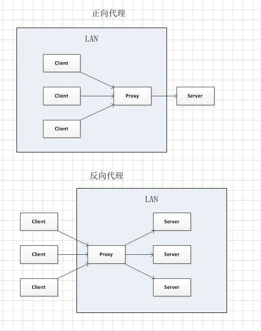
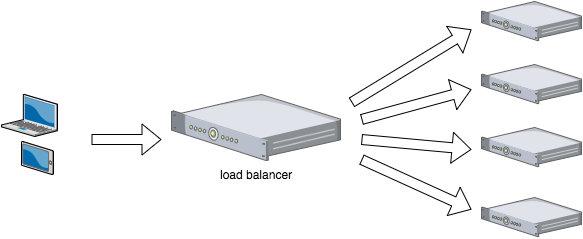

# 简介及相关概念

## 什么是Nginx

Nginx 是一个高性能的HTTP和反向代理服务器，特点是占有内存少，并发能力强，事实上 nginx 的 并发能力确实在同类型网页服务器中表现较好

Nginx 专为性能优化而开发，性能是最重要的考量，实现上非常注重效率，能经受高负载的考验，有报告表明能支持高达 50,000 个并发连接数

## 反向代理

**正向代理**

> 在客户端（浏览器）配置代理服务器，通过代理服务器进行互联网访问。正向代理的过程，它隐藏了真实的请求客户端，服务端不知道真实的客户端是谁，客户端请求的服务都被代理服务器代替来请求，某些科学上网工具扮演的就是典型的正向代理角色。

**反向代理**

> 反向代理是充当Web服务器网关的代理服务器。当您将请求发送到使用反向代理的Web服务器时，他们将先转到反向代理，由该代理将确定是将其路由到Web服务器还是将其阻止。
>
> 这意味着有了反向代理，永远不会与使用它的Web服务器进行直接通信。可以将它们看作web服务器或服务器集群的某种包装器。通过负载平衡和缓存，它们可以保护web免遭攻击，并提供更好的web性能。

两者的区别在于代理的对象不一样：**正向代理**代理的对象是客户端，**反向代理**代理的对象是服务端

## 负载均衡

客户端的流量首先会到达负载均衡服务器，由负载均衡服务器通过一定的**调度算法**将流量分发到不同的应用服务器上面，同时负载均衡服务器也会对应用服务器做周期性的健康检查，当发现故障节点时便动态的将节点从应用服务器集群中剔除，以此来保证应用的高可用。

## 动静分离

动静分离是将网站静态资源（HTML，JavaScript，CSS，img等文件）与后台应用分开部署，提高用户访问静态代码的速度，降低对后台应用访问。