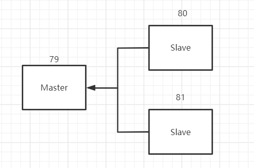
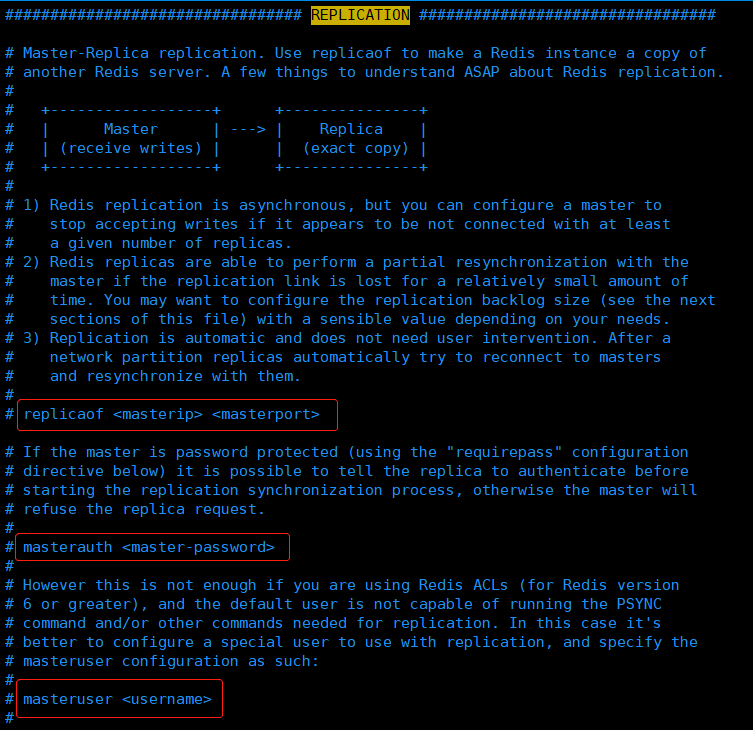
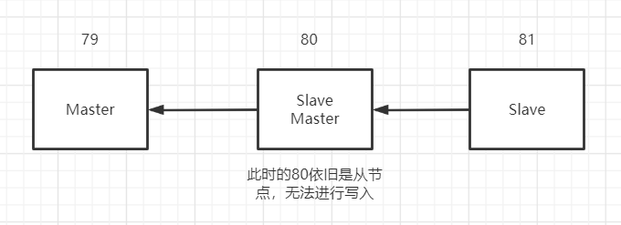

# Redis 主从复制

## 基本操作

### 查看信息

```bash
127.0.0.1:6379> INFO replication		# 查看当前 redis 的信息
# Replication
role:master								# 角色
connected_slaves:0						# 没有从机
master_repl_offset:0
repl_backlog_active:0
repl_backlog_size:1048576
repl_backlog_first_byte_offset:0
repl_backlog_histlen:0
```


## 简单的集群配置

### 复制配置文件

```shell
[root@iZuf688p52tbin7li3mbniZ etc ]# cp redis.conf redis79.conf
[root@iZuf688p52tbin7li3mbniZ etc ]# cp redis.conf redis80.conf
[root@iZuf688p52tbin7li3mbniZ etc ]# cp redis.conf redis81.conf
[root@iZuf688p52tbin7li3mbniZ etc ]# vim redis79.conf 
[root@iZuf688p52tbin7li3mbniZ etc ]# vim redis80.conf 
[root@iZuf688p52tbin7li3mbniZ etc ]# vim redis81.conf 
```

**主要修改文件如下内容：**

- port 6379													 # 端口
- daemonize yes                                  # 开启守护线程
- pidfile /var/run/redis_6379.pid	     #  pid 文件名
- logfile /var/log/redis/redis6379.log  # 日志文件名字
- dbfilename dump6379.rdb                # 备份文件名

### 启动

```shell
# 分别在三个终端执行启动命令
[root@iZuf688p52tbin7li3mbniZ bin ]# redis-server /etc/redis79.conf
[root@iZuf688p52tbin7li3mbniZ bin ]# redis-server /etc/redis80.conf
[root@iZuf688p52tbin7li3mbniZ bin ]# redis-server /etc/redis81.conf
# 查看 redis 进程信息
[root@iZuf688p52tbin7li3mbniZ bin ]# ps -ef | grep redis
root     31274     1  0 21:19 ?        00:00:00 redis-server *:6380
root     31284     1  0 21:20 ?        00:00:00 redis-server *:6381
root     31295     1  0 21:21 ?        00:00:00 redis-server *:6379
root     31299 30891  0 21:21 pts/2    00:00:00 grep --color=auto redis
```

> 启动完成后默认三个Redis进程都是主节点，一般情况下只要配置从节点

### 配置主从

**一主（6379）两从（6380/6381）**



```shell
#####################【6380】#####################
# 在从机中进行配置，指定主机的 ip 和 端口
127.0.0.1:6380> SLAVEOF 127.0.0.1 6379
OK
127.0.0.1:6380> INFO replication
# Replication
role:slave						# 当前角色
master_host:127.0.0.1			# 主机信息
master_port:6379				# 主机信息
master_link_status:up
master_last_io_seconds_ago:9
master_sync_in_progress:0
slave_repl_offset:15
slave_priority:100
slave_read_only:1
connected_slaves:0
master_repl_offset:0
repl_backlog_active:0
repl_backlog_size:1048576
repl_backlog_first_byte_offset:0
repl_backlog_histlen:0

#####################【6379】#####################
127.0.0.1:6379> INFO replication
# Replication
role:master							# 当前角色
connected_slaves:0
master_repl_offset:0
repl_backlog_active:0
repl_backlog_size:1048576
repl_backlog_first_byte_offset:0
repl_backlog_histlen:0
127.0.0.1:6379> INFO replication
# Replication
role:master
connected_slaves:1
slave0:ip=127.0.0.1,port=6380,state=online,offset=57,lag=0	# 从机信息
master_repl_offset:57
repl_backlog_active:1
repl_backlog_size:1048576
repl_backlog_first_byte_offset:2
repl_backlog_histlen:56


#####################【6381】#####################
127.0.0.1:6381> SLAVEOF 127.0.0.1 6379
OK
127.0.0.1:6381> INFO replication
# Replication
role:slave
master_host:127.0.0.1
master_port:6379
master_link_status:up
master_last_io_seconds_ago:5
master_sync_in_progress:0
slave_repl_offset:421
slave_priority:100
slave_read_only:1
connected_slaves:0
master_repl_offset:0
repl_backlog_active:0
repl_backlog_size:1048576
repl_backlog_first_byte_offset:0
repl_backlog_histlen:0


#####################【6379】#####################
127.0.0.1:6379> INFO replication
# Replication
role:master
connected_slaves:1
slave0:ip=127.0.0.1,port=6380,state=online,offset=57,lag=0
master_repl_offset:57
repl_backlog_active:1
repl_backlog_size:1048576
repl_backlog_first_byte_offset:2
repl_backlog_histlen:56
127.0.0.1:6379> INFO replication
# Replication
role:master
connected_slaves:2
slave0:ip=127.0.0.1,port=6380,state=online,offset=449,lag=1
slave1:ip=127.0.0.1,port=6381,state=online,offset=449,lag=1
master_repl_offset:449
repl_backlog_active:1
repl_backlog_size:1048576
repl_backlog_first_byte_offset:2
repl_backlog_histlen:448
```

> 真实的主从配置是在配置文件中配置，当前通过命令的方式在生产中不可取
>
> 通过配置文件配置：slaveof 和 masterauth 信息
>
> **注意：当前操作的redis版本为6.0.6，有些老版本 replicaof 配置信息是 slaveof **



### 细节

- 主机可读写，从机只读，如果在从机里面执行写操作会报错

  ```shell
  127.0.0.1:6380> SET k1 v1
  (error) READONLY You can't write against a read only slave.
  ```

- 主机断开连接，从机依旧连接到主机，但没有写操作，如果恢复主机与从机的连接，集群则恢复正常，从机可获取到主机的写信息

- 如果使用命令行的方式来配置主从，重启后将会失效，默认变为主机！如果再次使用命令配置主从，则会立马同步主从数据

### 复制原理

1. slave 启动成功连接到 master 后会由 slave 发送一个 sync 的同步命令‘
2. master 接收到命令，启动后台的存盘进程，同时手机所有接收到的用于修改数据集命令，在后台进程执行完毕之后，`master 将传送整个数据文件到 slave ，并完成一次全量同步`

> - 全量复制：由salve 服务在接收到数据文件后，将其存盘并加载到内存中
> - 增量复制：master 继续将新增的所有修改命令一次传给 salve ，并完成同步
>
> ​    **但是只要是重新连接 mater ，一次全量复制将被自动执行**

### 层层链路集群配置

**上一个主节点链接下一个从节点**



### 宕机后手动配置主节点

> 如果主机断开了链接，我们可以使用`SLAVEOF no one`让自己变成主节点，其他的从节点就可以手动连接到最新的主节点。如果此时之前挂掉的主节点恢复了，那就只能重新连接

```shell
127.0.0.1:6381> SLAVEOF no one
OK
127.0.0.1:6381> INFO replication
# Replication
role:master
connected_slaves:0
master_replid:f50ae7a5e1cc7cab235bd1b53d7c4cf42512bc4a
master_replid2:ac46edc69b70b690811c931e1a682c51aa2064db
master_repl_offset:1650
second_repl_offset:1651
repl_backlog_active:1
repl_backlog_size:1048576
repl_backlog_first_byte_offset:30
repl_backlog_histlen:1621
```

