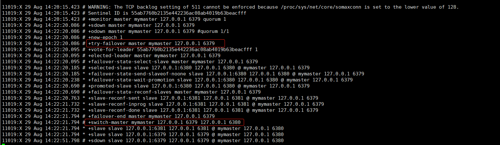

# Redis 哨兵模式

**主从切换技术的方法是：当主服务器宕机后，需要手动把一台从服务器切换为主服务器，这就需要人工干预，费事费力，还会造成一段时间内服务不可用。**这不是一种推荐的方式，更多时候，我们优先考虑**哨兵模式**。

## 概述

哨兵模式是一种特殊的模式，首先Redis提供了哨兵的命令，哨兵是一个独立的进程，作为进程，它会独立运行。其原理是**哨兵通过发送命令，等待Redis服务器响应，从而监控运行的多个Redis实例。**


这里的哨兵有两个作用

- 通过发送命令，让Redis服务器返回监控其运行状态，包括主服务器和从服务器。
- 当哨兵监测到master宕机，会自动将slave切换成master，然后通过**发布订阅模式**通知其他的从服务器，修改配置文件，让它们切换主机。

然而一个哨兵进程对Redis服务器进行监控，可能会出现问题，为此，我们可以使用多个哨兵进行监控。各个哨兵之间还会进行监控，这样就形成了多哨兵模式。

用文字描述一下**故障切换（failover）**的过程。假设主服务器宕机，哨兵1先检测到这个结果，系统并不会马上进行failover过程，仅仅是哨兵1主观的认为主服务器不可用，这个现象成为**主观下线**。当后面的哨兵也检测到主服务器不可用，并且数量达到一定值时，那么哨兵之间就会进行一次投票，投票的结果由一个哨兵发起，进行failover操作。切换成功后，就会通过发布订阅模式，让各个哨兵把自己监控的从服务器实现切换主机，这个过程称为**客观下线**。这样对于客户端而言，一切都是透明的。

## 配置哨兵模式

配置3个哨兵和1主2从的Redis服务器来演示这个过程。


### 1.配置哨兵模式配置文件：sentinel.conf

```shell
# 配置监听的主服务器
# sentinel monitor 代表监控
# mymaster 代表服务器的名称，可以自定义
# 127.0.0.1 代表监控的主服务器，
# 6379 代表端口
# 1 代表只有1个或1个以上的哨兵认为主服务器不可用的时候，才会进行故障转移操作。
sentinel monitor mymaster 127.0.0.1 6379 1
```

### 2.启动哨兵

```shell
src →  redis-sentinel /etc/sentinel.conf 
                _._                                                  
           _.-``__ ''-._                                             
      _.-``    `.  `_.  ''-._           Redis 6.0.6 (00000000/0) 64 bit
  .-`` .-```.  ```\/    _.,_ ''-._                                   
 (    '      ,       .-`  | `,    )     Running in sentinel mode
 |`-._`-...-` __...-.``-._|'` _.-'|     Port: 26379
 |    `-._   `._    /     _.-'    |     PID: 11011
  `-._    `-._  `-./  _.-'    _.-'                                   
 |`-._`-._    `-.__.-'    _.-'_.-'|                                  
 |    `-._`-._        _.-'_.-'    |           http://redis.io        
  `-._    `-._`-.__.-'_.-'    _.-'                                   
 |`-._`-._    `-.__.-'    _.-'_.-'|                                  
 |    `-._`-._        _.-'_.-'    |                                  
  `-._    `-._`-.__.-'_.-'    _.-'                                   
      `-._    `-.__.-'    _.-'                                       
          `-._        _.-'                                           
              `-.__.-'                                               

11011:X 29 Aug 14:19:40.465 # WARNING: The TCP backlog setting of 511 cannot be enforced because /proc/sys/net/core/somaxconn is set to the lower value of 128.
11011:X 29 Aug 14:19:40.467 # Sentinel ID is 55ab7760b2135e442236ac08ab4019b63beacfff
11011:X 29 Aug 14:19:40.467 # +monitor master mymaster 127.0.0.1 6379 quorum 1
11011:X 29 Aug 14:19:40.468 * +slave slave 127.0.0.1:6380 127.0.0.1 6380 @ mymaster 127.0.0.1 6379
11011:X 29 Aug 14:19:40.470 * +slave slave 127.0.0.1:6381 127.0.0.1 6381 @ mymaster 127.0.0.1 6379
```

>  如果主节点断开了，这个时候就会自动通过投票算法在从机中选取一个新的主节点



> **如果此时老的主机点恢复，那么也只能做新的主节点的从节点**

```shell
########################【6379】########################
127.0.0.1:6379> INFO replication
# Replication
role:slave
master_host:127.0.0.1
master_port:6380
master_link_status:up
master_last_io_seconds_ago:1
master_sync_in_progress:0
slave_repl_offset:38561
slave_priority:100
slave_read_only:1
connected_slaves:0
master_replid:95a958bad6eb84328698e167be4c3061b2a09763
master_replid2:0000000000000000000000000000000000000000
master_repl_offset:38561
second_repl_offset:-1
repl_backlog_active:1
repl_backlog_size:1048576
repl_backlog_first_byte_offset:38562
repl_backlog_histlen:0

########################【6380】########################
127.0.0.1:6380> INFO replication
# Replication
role:master
connected_slaves:2
slave0:ip=127.0.0.1,port=6381,state=online,offset=49448,lag=1
slave1:ip=127.0.0.1,port=6379,state=online,offset=49448,lag=1
master_replid:95a958bad6eb84328698e167be4c3061b2a09763
master_replid2:0745fc5595f3c007989a9e050ae1eb42d0ec29f6
master_repl_offset:49448
second_repl_offset:9874
repl_backlog_active:1
repl_backlog_size:1048576
repl_backlog_first_byte_offset:1
repl_backlog_histlen:49448
```


## 总结

1. **Redis主从**

　　　　优点：1、高可靠性，主从实时备份，有效解决单节点数据丢失问题。

　　　　　　　2、可做读写分离，从库分担读操作，缓解主库压力

　　　　缺点：主库异常，需要手动主从切换

2. **Redis哨兵模式**

　　　　优点：1、有效解决主从模式主库异常手动主从切换的问题

　　　　缺点：1、运维复杂，哨兵选举期间，不能对外提供服务