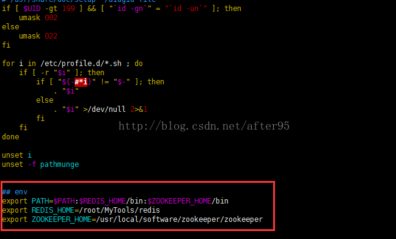
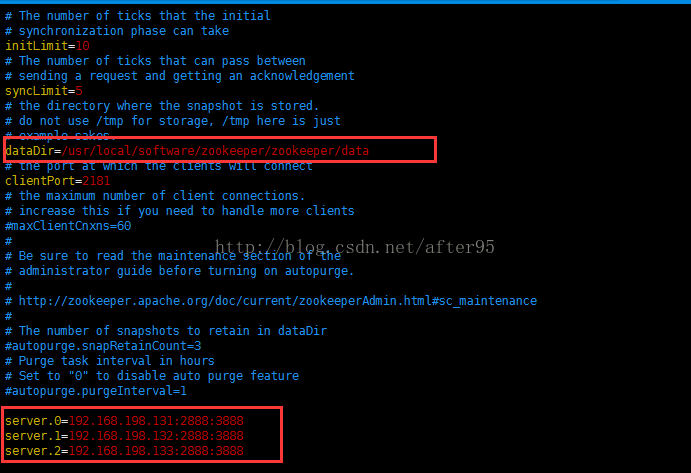
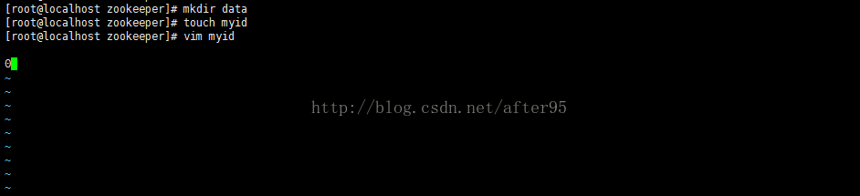
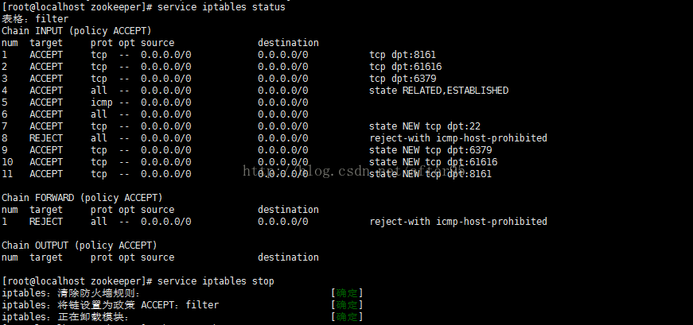
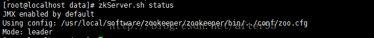

# Linux 环境下 Zookeeper 集群环境搭建
---
## 一、注意
> 在集群模式下，建议至少部署3个zk进程，或者部署奇数个zk进程。如果只部署2个zk进程，当其中一个zk进程挂掉后，剩下的一个进程并不能构成一个quorum的大多数。因此，部署2个进程甚至比单机模式更不可靠，因为2个进程其中一个不可用的可能性比一个进程不可用的可能性还大。以下操作在集群内的每个机器上都需要重操作一遍

## 二、创建目录 下载资源
```shell
[root@localhost /]# cd /usr/local/
[root@localhost local]# mkdir software
[root@localhost local]# cd software/
[root@localhost software]# mkdir zookeeper
[root@localhost software]# cd zookeeper/
[root@localhost zookeeper]# wget http://apache.fayea.com/zookeeper/zookeeper-3.4.6/zookeeper-3.4.6.tar.gz
```

## 三、解压下载的资源并重命名
```shell
[root@localhost zookeeper]# ls
zookeeper-3.4.6.tar.gz
[root@localhost zookeeper]# tar -xzvf zookeeper-3.4.6.tar.gz
[root@localhost zookeeper]# mv zookeeper-3.4.6 zookeeper
```

## 四、配置环境变量
> 1. 在配置文件的最后面加上`ZOOKEEPER_HOM`E,值为zookeeper的路径
> 
> 2. 在PATH后面加上:`$ZOOKEEPER_HOME/bin`,多个环境变量之间以冒号隔开
> 
>  `[root@localhost zookeeper]# vim /etc/profile`
>  
> 

## 五、配置完环境变量之后，需要将配置文件编译一下，使其生效：
`[root@localhost zookeeper]# source /etc/profile`

## 六、进入zookeeper的conf目录，重命名zoo_simple.cfg，然后编辑：zoo.cfg
> ```shell
> [root@localhost conf]# cd /usr/local/software/zookeeper/zookeeper/conf
> [root@localhost conf]# mv zoo_sample.cfg zoo.cfg
> [root@localhost conf]# vim zoo.cfg 
> ```
> 
> 结果如图：
> 

## 七、创建：/usr/local/software/zookeeper/zookeeper/data 目录，并在data目录下穿件 myid 文件，然后编辑 myid文件（文件的内容根据上面配置的server索引一致）
> ```shell
> [root@localhost zookeeper]# mkdir data
> [root@localhost zookeeper]# touch myid
> [root@localhost zookeeper]# vim myid
> ```
> 结果如图：
> 

## 八、启动
```shell
[root@localhost zookeeper]# zkServer.sh start
JMX enabled by default
Using config: /usr/local/software/zookeeper/zookeeper/bin/../conf/zoo.cfg
Starting zookeeper ... STARTED
```
## 九、查看状态，如果发生如图错误，则检查防火墙状态，然后关闭，最后再尝试一下zkServer.sh status：






> 本文章迁移于CSDN[Linux 环境下 Zookeeper 集群环境搭建](https://blog.csdn.net/after95/article/details/68490449)