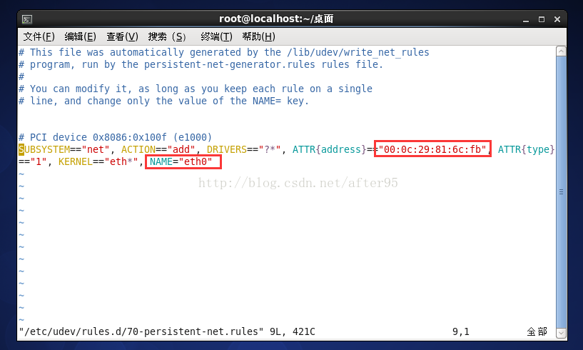
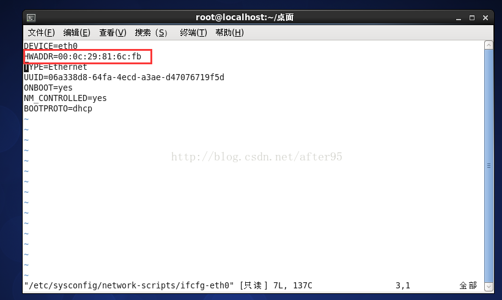
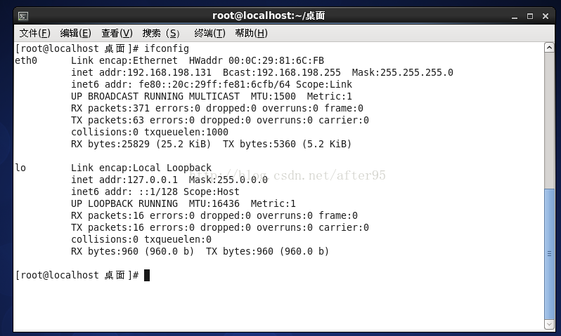

# VMWare克隆的虚拟机无法联网
--- 

## 一、首先确定虚拟机系统为centos6,源虚拟机的网络适配器是NAT模式

## 二、重新生成MAC地址
> 右键虚拟机===>设置===>点击网络适配器===>高级===>生成
> 
> 因为这是通过克隆产生的虚拟机，此时的MAC地址和源虚拟机是一样的，所以需要重新生成
> 

## 三、修改网络规则配置
> 1. 进入终端通过 `vim /etc/udev/rules.d/70-persistent-net.rules`(该文件可能有多个配置，删除其他配置，剩下与当前MAC地址一致的一个，此时可能需要查看一下当前的 MAC地址)
> 2. 修改NAME=“ eth0”，如图：
> 
> 

## 四、修改网卡配置
> 1. `vim /etc/sysconfig/network-scripts/ifcfg-eth0`
> 2. 把HWADDR 的值修改成和我们生成的MAC一致，如图：
> 

## 五、重启并查看结果
> 1. 终端输入`reboot` 进行重启
> 2. 终端输入`ifconfig` 进行查看,如图：
> 

> 本文迁移于CSDN[VMWare克隆的虚拟机无法联网](https://blog.csdn.net/after95/article/details/68482867)

