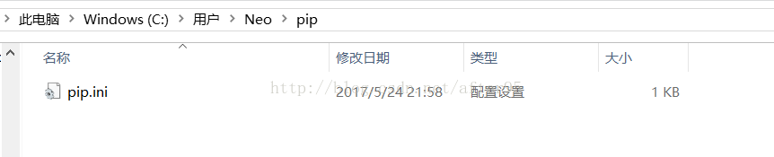

# pip 安装 和 pip.ini 配置
---

## 一、安装pip
1. 下载pip安装包，随意保存在某个目录，例如 D盘 根目录[下载地址](https://pypi.python.org/pypi/pip#downloads)
2. 下载完成后解压
3. 通过cmd窗口 `cd` 到解压文件的目录
4. 通过命令进行安装：
```
python setup.py install
```
5. 测试是否安装成功（若显示不存在命令之类的，建议重启电脑）
```
pip list
```

## 二、配置pip.ini(解决国外镜像安装慢，连接超时的问题)
1. 如图所示，在对应目录(当前用户下创建pip文件夹)下新建文件：pip.ini

2. 编辑文件`pip.ini`:
```
[global]
index-url = https://pypi.doubanio.com/simple/
[install]
trusted-host=pypi.doubanio.com
```

3. 配置环境变量
> `PATH` 尾部追加上：
> ```
> %HOME%\pip\pip.ini
> ```

**到此已配置完成，完成后速度将会提升至少10倍**

> 本文章迁移于CSDN[pip 安装 和 pip.ini 配置](https://blog.csdn.net/after95/article/details/52584738)