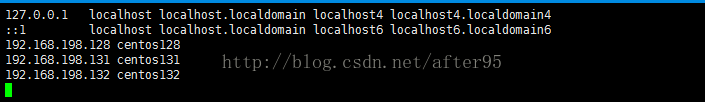
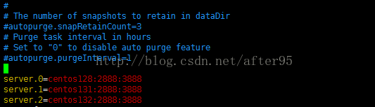

# zookeeper 集群重启之后无法使用
---

## 一、首先我们来看一下报错信息：
```shell
[root@localhost ~]# zkServer.sh start
JMX enabled by default
Using config: /usr/local/software/zookeeper/zookeeper/bin/../conf/zoo.cfg
Starting zookeeper ... STARTED
[root@localhost ~]# zkServer.sh status
JMX enabled by default
Using config: /usr/local/software/zookeeper/zookeeper/bin/../conf/zoo.cfg
Error contacting service. It is probably not running.
[root@localhost ~]# zkCli.sh
Connecting to localhost:2181
2017-03-31 10:14:19,397 [myid:] - INFO  [main:Environment@100] - Client environment:zookeeper.version=3.4.6-1569965, built on 02/20/2014 09:09 GMT
2017-03-31 10:14:19,410 [myid:] - INFO  [main:Environment@100] - Client environment:host.name=localhost
2017-03-31 10:14:19,411 [myid:] - INFO  [main:Environment@100] - Client environment:java.version=1.7.0_09-icedtea
2017-03-31 10:14:19,422 [myid:] - INFO  [main:Environment@100] - Client environment:java.vendor=Oracle Corporation
2017-03-31 10:14:19,423 [myid:] - INFO  [main:Environment@100] - Client environment:java.home=/usr/lib/jvm/java-1.7.0-openjdk-1.7.0.9.x86_64/jre
2017-03-31 10:14:19,423 [myid:] - INFO  [main:Environment@100] - Client environment:java.class.path=/usr/local/software/zookeeper/zookeeper/bin/../build/classes:/usr/local/software/zookeeper/zookeeper/bin/../build/lib/*.jar:/usr/local/software/zookeeper/zookeeper/bin/../lib/slf4j-log4j12-1.6.1.jar:/usr/local/software/zookeeper/zookeeper/bin/../lib/slf4j-api-1.6.1.jar:/usr/local/software/zookeeper/zookeeper/bin/../lib/netty-3.7.0.Final.jar:/usr/local/software/zookeeper/zookeeper/bin/../lib/log4j-1.2.16.jar:/usr/local/software/zookeeper/zookeeper/bin/../lib/jline-0.9.94.jar:/usr/local/software/zookeeper/zookeeper/bin/../zookeeper-3.4.6.jar:/usr/local/software/zookeeper/zookeeper/bin/../src/java/lib/*.jar:/usr/local/software/zookeeper/zookeeper/bin/../conf:
2017-03-31 10:14:19,423 [myid:] - INFO  [main:Environment@100] - Client environment:java.library.path=/usr/java/packages/lib/amd64:/usr/lib64:/lib64:/lib:/usr/lib
2017-03-31 10:14:19,423 [myid:] - INFO  [main:Environment@100] - Client environment:java.io.tmpdir=/tmp
2017-03-31 10:14:19,424 [myid:] - INFO  [main:Environment@100] - Client environment:java.compiler=<NA>
2017-03-31 10:14:19,424 [myid:] - INFO  [main:Environment@100] - Client environment:os.name=Linux
2017-03-31 10:14:19,425 [myid:] - INFO  [main:Environment@100] - Client environment:os.arch=amd64
2017-03-31 10:14:19,427 [myid:] - INFO  [main:Environment@100] - Client environment:os.version=2.6.32-358.el6.x86_64
2017-03-31 10:14:19,427 [myid:] - INFO  [main:Environment@100] - Client environment:user.name=root
2017-03-31 10:14:19,427 [myid:] - INFO  [main:Environment@100] - Client environment:user.home=/root
2017-03-31 10:14:19,430 [myid:] - INFO  [main:Environment@100] - Client environment:user.dir=/root
2017-03-31 10:14:19,435 [myid:] - INFO  [main:ZooKeeper@438] - Initiating client connection, connectString=localhost:2181 sessionTimeout=30000 watcher=org.apache.zookeeper.ZooKeeperMain$MyWatcher@11286929
Welcome to ZooKeeper!
2017-03-31 10:14:20,131 [myid:] - INFO  [main-SendThread(localhost:2181):ClientCnxn$SendThread@975] - Opening socket connection to server localhost/127.0.0.1:2181. Will not attempt to authenticate using SASL (unknown error)
2017-03-31 10:14:20,176 [myid:] - INFO  [main-SendThread(localhost:2181):ClientCnxn$SendThread@852] - Socket connection established to localhost/127.0.0.1:2181, initiating session
JLine support is enabled
2017-03-31 10:14:20,187 [myid:] - INFO  [main-SendThread(localhost:2181):ClientCnxn$SendThread@1098] - Unable to read additional data from server sessionid 0x0, likely server has closed socket, closing socket connection and attempting reconnect
[zk: localhost:2181(CONNECTING) 0] 2017-03-31 10:14:21,065 [myid:] - INFO  [main-SendThread(localhost:2181):ClientCnxn$SendThread@975] - Opening socket connection to server localhost/0:0:0:0:0:0:0:1:2181. Will not attempt to authenticate using SASL (unknown error)
2017-03-31 10:14:21,065 [myid:] - INFO  [main-SendThread(localhost:2181):ClientCnxn$SendThread@852] - Socket connection established to localhost/0:0:0:0:0:0:0:1:2181, initiating session
2017-03-31 10:14:21,067 [myid:] - INFO  [main-SendThread(localhost:2181):ClientCnxn$SendThread@1098] - Unable to read additional data from server sessionid 0x0, likely server has closed socket, closing socket connection and attempting reconnect
2017-03-31 10:14:22,259 [myid:] - INFO  [main-SendThread(localhost:2181):ClientCnxn$SendThread@975] - Opening socket connection to server localhost/127.0.0.1:2181. Will not attempt to authenticate using SASL (unknown error)
2017-03-31 10:14:22,260 [myid:] - INFO  [main-SendThread(localhost:2181):ClientCnxn$SendThread@852] - Socket connection established to localhost/127.0.0.1:2181, initiating session
2017-03-31 10:14:22,261 [myid:] - INFO  [main-SendThread(localhost:2181):ClientCnxn$SendThread@1098] - Unable to read additional data from server sessionid 0x0, likely server has closed socket, closing socket connection and attempting reconnect
2017-03-31 10:14:23,162 [myid:] - INFO  [main-SendThread(localhost:2181):ClientCnxn$SendThread@975] - Opening socket connection to server localhost/0:0:0:0:0:0:0:1:2181. Will not attempt to authenticate using SASL (unknown error)
2017-03-31 10:14:23,163 [myid:] - INFO  [main-SendThread(localhost:2181):ClientCnxn$SendThread@852] - Socket connection established to localhost/0:0:0:0:0:0:0:1:2181, initiating session
2017-03-31 10:14:23,164 [myid:] - INFO  [main-SendThread(localhost:2181):ClientCnxn$SendThread@1098] - Unable to read additional data from server sessionid 0x0, likely server has closed socket, closing socket connection and attempting reconnect
2017-03-31 10:14:24,911 [myid:] - INFO  [main-SendThread(localhost:2181):ClientCnxn$SendThread@975] - Opening socket connection to server localhost/127.0.0.1:2181. Will not attempt to authenticate using SASL (unknown error)
2017-03-31 10:14:24,912 [myid:] - INFO  [main-SendThread(localhost:2181):ClientCnxn$SendThread@852] - Socket connection established to localhost/127.0.0.1:2181, initiating session
2017-03-31 10:14:24,914 [myid:] - INFO  [main-SendThread(localhost:2181):ClientCnxn$SendThread@1098] - Unable to read additional data from server sessionid 0x0, likely server has closed socket, closing socket connection and attempting reconnect
2017-03-31 10:14:25,837 [myid:] - INFO  [main-SendThread(localhost:2181):ClientCnxn$SendThread@975] - Opening socket connection to server localhost/0:0:0:0:0:0:0:1:2181. Will not attempt to authenticate using SASL (unknown error)
```

## 二、然后网上查了很多，最后修改：/etc/hosts 文件解决的问题,文件修改成如图结果：
> ```shell
> [root@localhost ~]# vim /etc/hosts
> [root@localhost ~]# service network restart
> [root@localhost conf]# service iptables stop
> ```
> 

## 三、既然我们修改了hosts，那么我们也需要对zoo.cfg文件进行修改，文件修改成如图结果：
> ```shell
> [root@localhost ~]# cd /usr/local/software/zookeeper/zookeeper/conf/
> [root@localhost conf]# vim zoo.cfg
> ```
> 

## 四、 最后我们再重新执行以下之前的操作：
```shell
[root@localhost conf]# zkServer.sh stop
JMX enabled by default
Using config: /usr/local/software/zookeeper/zookeeper/bin/../conf/zoo.cfg
Stopping zookeeper ... STOPPED
[root@localhost conf]# zkServer.sh start
JMX enabled by default
Using config: /usr/local/software/zookeeper/zookeeper/bin/../conf/zoo.cfg
Starting zookeeper ... STARTED
[root@localhost conf]# zkServer.sh status
JMX enabled by default
Using config: /usr/local/software/zookeeper/zookeeper/bin/../conf/zoo.cfg
Mode: follower
```
> 本文章迁移于CSDN[zookeeper 集群重启之后无法使用](https://blog.csdn.net/after95/article/details/68923154)