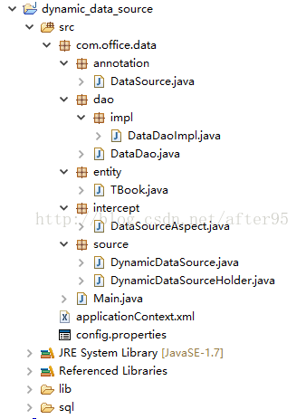
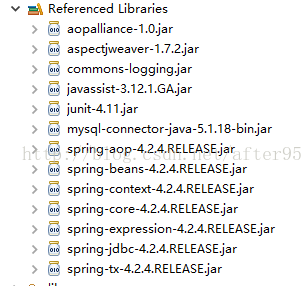
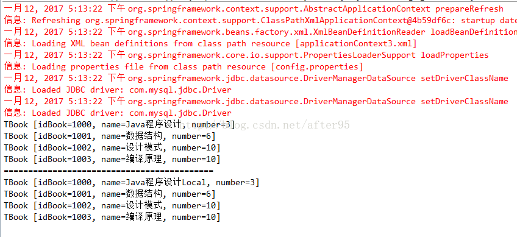

# 基于注解和Spring的多数据源配置和使用
---

## 一、项目结构


## 二、所需jar


## 三、定义名为DataSource的注解
```java
package com.office.data.annotation;

import java.lang.annotation.ElementType;
import java.lang.annotation.Retention;
import java.lang.annotation.RetentionPolicy;
import java.lang.annotation.Target;

/**
 * 定义名为DataSource的注解
 * @author Administrator
 *
 */
@Target({ElementType.TYPE,ElementType.METHOD})
@Retention(RetentionPolicy.RUNTIME)
public @interface DataSource {
    String value();
}

```

## 四、动态数据源
```java
package com.office.data.source;

import org.springframework.jdbc.datasource.lookup.AbstractRoutingDataSource;
/**
 * 动态数据源 
 * 实现spring 类方法AbstractRoutingDataSource.determineCurrentLookupKey 
 * 以更新数据源bean 
 * @author Administrator
 *
 */
public class DynamicDataSource extends AbstractRoutingDataSource{

    public final static String DEFAULT_DB="defaultDB";
    public final static String LOCAL_DB="localDB";
    @Override
    protected Object determineCurrentLookupKey() {
        //从自定义的位置获取数据源标识
        return DynamicDataSourceHolder.getDataSourceType();
    }

}
```

## 五、设置DB类型
```java
package com.office.data.source;

public class DynamicDataSourceHolder {
    
    private static final ThreadLocal<String> contextHolder=new ThreadLocal<String>();
    
    /**
     * 设置DB类型
     * @param String
     */
    public static void setDataSourceType(String String){
        contextHolder.set(String);
    }
    
    /**
     * 获取DB类型
     * @return
     */
    public static String getDataSourceType(){
        return (String)contextHolder.get();
    }
    
    /**
     * 清除DB类型
     */
    public static void clearDataSourceType(){
        contextHolder.remove();
    }


}

```

## 六、定义AOP切面，以便拦截所有带@DataSource的方法
```java
package com.office.data.intercept;

import java.lang.reflect.Method;

import org.aspectj.lang.JoinPoint;
import org.aspectj.lang.reflect.MethodSignature;

import com.office.data.annotation.DataSource;
import com.office.data.source.DynamicDataSourceHolder;

/**
 * 定义AOP切面，以便拦截所有带@DataSource的方法
 * @author Administrator
 *
 */
public class DataSourceAspect {

    /**
     * 拦截目标方法，获取由@DataSource指定的数据源标识，设置到线程存储中以便切换数据源
     * @param point
     * @throws Exception
     */
    public void intercept(JoinPoint point)throws Exception{
        Class<?> target=point.getTarget().getClass();
        MethodSignature signature=(MethodSignature) point.getSignature();
        // 默认使用目标类型的注解，如果没有则使用其实现接口的注解
        for (Class<?> clazz:target.getInterfaces()) {
            resolveDataSource(clazz, signature.getMethod());
        }
        resolveDataSource(target, signature.getMethod());
    }
    
    /**
     * 提取目标对象方法注解和类型注解中的数据源标识
     * @param clazz
     * @param method
     */
    private void resolveDataSource(Class<?> clazz,Method method){
        try {
            Class<?>[] types=method.getParameterTypes();
            // 默认使用类型注解
            if(clazz.isAnnotationPresent(DataSource.class)){
                DataSource source=clazz.getAnnotation(DataSource.class);
                DynamicDataSourceHolder.setDataSourceType(source.value());
            }
            // 方法注解可以覆盖类型注解
            Method m=clazz.getMethod(method.getName(), types);
            if(m!=null&&m.isAnnotationPresent(DataSource.class)){
                DataSource source=m.getAnnotation(DataSource.class);
                DynamicDataSourceHolder.setDataSourceType(source.value());
            }
        } catch (Exception e) {
            System.out.println(clazz+":"+e.getMessage());
        } 
    }
    
}
```

## 七、定义实体
```java
package com.office.data.entity;
/**
 * 定义实体
 * @author Administrator
 *
 */
public class TBook {
    private String idBook;// 图书ID

    private String name;// 图书名称

    private int number;// 馆藏数量

    public TBook() {
    }

    public String getIdBook() {
        return idBook;
    }

    public void setIdBook(String idBook) {
        this.idBook = idBook;
    }

    public String getName() {
        return name;
    }

    public void setName(String name) {
        this.name = name;
    }

    public int getNumber() {
        return number;
    }

    public void setNumber(int number) {
        this.number = number;
    }

    @Override
    public String toString() {
        return "TBook [idBook=" + idBook + ", name=" + name + ", number="
                + number + "]";
    }

    public TBook(String idBook, String name, int number) {
        super();
        this.idBook = idBook;
        this.name = name;
        this.number = number;
    }

}

```

## 八、声明dao接口
```java
package com.office.data.dao;

import java.util.List;

import com.office.data.entity.TBook;
/**
 * 
 * @author Administrator
 *
 */
public interface DataDao {
    
    List<TBook> getBaseList();
    
    List<TBook> getLocalList();
}

```

## 九、实现dao接口
```java
package com.office.data.dao.impl;

import java.util.ArrayList;
import java.util.List;

import org.springframework.beans.factory.annotation.Autowired;
import org.springframework.jdbc.core.JdbcTemplate;
import org.springframework.jdbc.support.rowset.SqlRowSet;
import org.springframework.stereotype.Service;

import com.office.data.annotation.DataSource;
import com.office.data.dao.DataDao;
import com.office.data.entity.TBook;
import com.office.data.source.DynamicDataSource;

@Service
@DataSource(DynamicDataSource.DEFAULT_DB)
public class DataDaoImpl implements DataDao {
    @Autowired
    private JdbcTemplate jdbcTemplate;

    @Override
    public List<TBook> getBaseList() {
        return getBooks();
    }

    @Override
    @DataSource(DynamicDataSource.LOCAL_DB)
    public List<TBook> getLocalList() {
        return getBooks();
    }

    private List<TBook> getBooks() {
        List<TBook> books = new ArrayList<TBook>();
        String sql = "SELECT t.id_book,t.name,t.number FROM t_book t";
        SqlRowSet rs = jdbcTemplate.queryForRowSet(sql);
        while (rs.next()) {
            TBook book = new TBook();
            book.setIdBook(rs.getString(1));
            book.setName(rs.getString(2));
            book.setNumber(rs.getInt(3));
            books.add(book);
        }
        return books;
    }
    /*
     * public JdbcTemplate getJdbcTemplate() { return jdbcTemplate; } public
     * void setJdbcTemplate(JdbcTemplate jdbcTemplate) { this.jdbcTemplate =
     * jdbcTemplate; }
     */

}

```

## 十、spring配置文件 applicationContext.xml
```xml
<?xml version="1.0" encoding="UTF-8"?>
<beans xmlns="http://www.springframework.org/schema/beans"
    xmlns:xsi="http://www.w3.org/2001/XMLSchema-instance"
    xmlns:p="http://www.springframework.org/schema/p"
    xmlns:context="http://www.springframework.org/schema/context"
    xmlns:jdbc="http://www.springframework.org/schema/jdbc"
    xmlns:aop="http://www.springframework.org/schema/aop"
    xsi:schemaLocation="http://www.springframework.org/schema/jdbc http://www.springframework.org/schema/jdbc/spring-jdbc-4.2.xsd
        http://www.springframework.org/schema/aop http://www.springframework.org/schema/aop/spring-aop-4.2.xsd
        http://www.springframework.org/schema/beans http://www.springframework.org/schema/beans/spring-beans-3.1.xsd
        http://www.springframework.org/schema/context http://www.springframework.org/schema/context/spring-context-4.2.xsd">
    <!--==========================================================-->
    <!--=========================自动扫描=========================-->
    <!--==========================================================-->
    <context:annotation-config/>
    <context:component-scan base-package="com.office"/> 
    
    <!--==========================================================-->
    <!--========================导入属性文件=======================-->
    <!--==========================================================-->
    <context:property-placeholder location="classpath:config.properties"/>
    
    <!--==========================================================-->
    <!--======================配置数据源===========================-->
    <!--==========================================================-->
    <bean id="baseDataSource" class="org.springframework.jdbc.datasource.DriverManagerDataSource">
        <property name="username" value="${jdbc.username}"/>
        <property name="password" value="${jdbc.password}"/>
        <property name="driverClassName" value="${jdbc.driverClassName}"/>
        <property name="url" value="${jdbc.url}"/>
    </bean>
    
    
    <!--==========================================================-->
    <!--======================本地数据源配置=======================-->
    <!--==========================================================-->
    <bean id="localDataSource" class="org.springframework.jdbc.datasource.DriverManagerDataSource" parent="baseDataSource">
        <property name="url" value="${local.url}"/>
    </bean>
    
    
    <bean id="dataSource" class="com.office.data.source.DynamicDataSource">
        <property name="targetDataSources">
            <!-- 指定lookupKey和与之对应的数据源 -->
            <map key-type="java.lang.String">
                <entry key="defaultDB" value-ref="baseDataSource"/>
                <entry key="localDB" value-ref="localDataSource"/>
            </map>
        </property>
        <!-- 指定默认的数据源 -->
        <property name="defaultTargetDataSource" ref="baseDataSource"/>
    </bean>
    
    <!--==========================================================-->
    <!--======================数据源拦截器=========================-->
    <!--==========================================================-->
    <bean id="dataSourceAspect" class="com.office.data.intercept.DataSourceAspect"/>
    <aop:config>
        <aop:aspect ref="dataSourceAspect">
            <!-- 拦截所有的Dao层方法 -->
            <aop:pointcut id="dataSourcePointcut" expression="execution(* com.office.data.dao.*.*(..))" />
            <aop:before pointcut-ref="dataSourcePointcut" method="intercept"/>
        </aop:aspect>
    </aop:config>
    
    
    <bean id="jdbcTemplate" class="org.springframework.jdbc.core.JdbcTemplate">
        <property name="dataSource">
            <ref local="dataSource"/>
        </property> 
    </bean>
    
    <bean id="dataDao" class="com.office.data.dao.impl.DataDaoImpl"/>
    
</beans>
```

## 十一、config.properties 配置文件
```text
#********************************************
#******************Base JDBC*****************
#********************************************
jdbc.username=root
jdbc.password=root
jdbc.driverClassName=com.mysql.jdbc.Driver
jdbc.url=jdbc:mysql://host1:3306/mydb

#********************************************
#******************Local JDBC****************
#********************************************
local.username=root
local.password=root
local.driverClassName=com.mysql.jdbc.Driver
local.url=jdbc:mysql://host2:3306/mydb
```

## 十二、建表语句
```sql
/*
Navicat MySQL Data Transfer

Source Server         : MySql
Source Server Version : 50522
Source Host           : localhost:3306
Source Database       : mydb

Target Server Type    : MYSQL
Target Server Version : 50522
File Encoding         : 65001

Date: 2017-01-13 09:17:03
*/

SET FOREIGN_KEY_CHECKS=0;

-- ----------------------------
-- Table structure for t_book
-- ----------------------------
DROP TABLE IF EXISTS `t_book`;
CREATE TABLE `t_book` (
  `id_book` varchar(20) NOT NULL COMMENT '图书ID',
  `name` varchar(100) NOT NULL COMMENT '图书名称',
  `number` int(11) NOT NULL COMMENT '馆藏数量',
  PRIMARY KEY (`id_book`)
) ENGINE=InnoDB DEFAULT CHARSET=utf8 COMMENT='图书表';

-- ----------------------------
-- Records of t_book
-- ----------------------------
INSERT INTO `t_book` VALUES ('1000', 'Java程序设计', '3');
INSERT INTO `t_book` VALUES ('1001', '数据结构', '6');
INSERT INTO `t_book` VALUES ('1002', '设计模式', '10');
INSERT INTO `t_book` VALUES ('1003', '编译原理', '10');

```

## 十三、测试类
```java
package com.office.data;

import java.util.List;

import org.springframework.beans.factory.BeanFactory;
import org.springframework.context.support.ClassPathXmlApplicationContext;

import com.office.data.dao.DataDao;
import com.office.data.entity.TBook;
@SuppressWarnings("resource")
public class Main {

    public static void main(String[] args) {
        BeanFactory factory=new ClassPathXmlApplicationContext("applicationContext.xml");
        DataDao dataDao=(DataDao) factory.getBean("dataDao");
        List<TBook> books=dataDao.getBaseList();
        for (TBook tBook : books) {
            System.out.println(tBook);
        }
        System.out.println("===========================================");
        books=dataDao.getLocalList();
        for (TBook tBook : books) {
            System.out.println(tBook);
        }
    }
}

```

## 十三、测试结果


> 本文迁移于CSDN[基于注解和Spring的多数据源配置和使用](https://blog.csdn.net/after95/article/details/54405447)