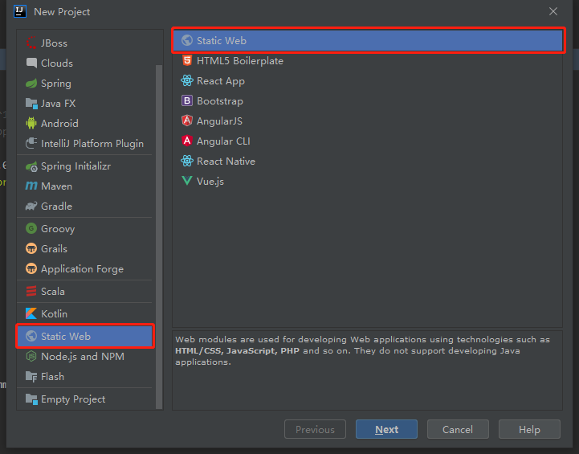
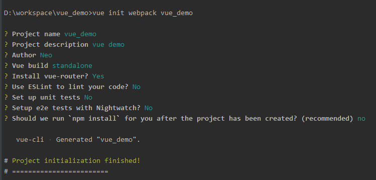

# 环境搭建

## 安装
### 下载地址：[https://nodejs.org/en/download/](https://nodejs.org/en/download/)
> 1. 下载完成后安装（按默认方式安装即可）
> 2. 打开cmd输入下面的命令进行验证是否安装成功
> ```sh
> node -v
> npm -v
> ```

## 配置国内淘宝镜像加快访问速度
`npm i -g cnpm --registry=https://registry.npm.taobao.org`


## 搭建项目
### 新建项目
> Create New Project > Static Web > 填写project name和选择保存的工作空间>Finish 



### 初始化包结构:`vue init webpack vue_demo`
> vue_demo为前面新建的项目名。可参考此处初始化设置。



### 启动
> 1. 编译：`cnpm install`
> 2. 启动：`cnpm run dev` ，启动后会提示项目访问路径默认：[http://localhost:8080](http://localhost:8080)
> 


## 问题解决
### idea Terminal 提示 `'npm' 不是内部或外部命令，也不是可运行的程序或批处理文件。`
> 1. Settings > Tools > Terminal > Shell path 处填写：`C:\Windows\System32\cmd.exe`
> 2. 重启idea

### 'vue' 不是内部或外部命令，也不是可运行的程序 或批处理文件的方法
> 1. 进入`npm`的安装目录，查看是否有`vue.cmd`文件
> 2. 没有的话在`cmd`执行全局卸载：`npm uninstall vue-cli -g`
> 3. 最后执行全局安装：`cnpm install -g @vue/cli`（如果报错则执行:`npm install vue-cli -g`后再重新执行）